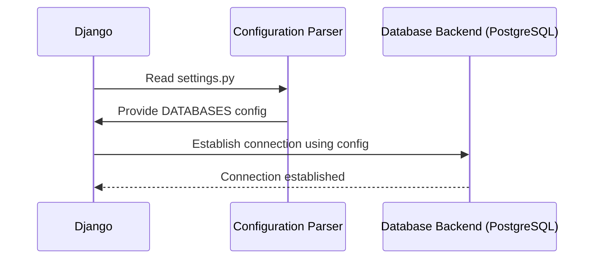

# Chapter 1: Django Settings Configuration

Welcome to your first adventure in Django development with `django.nV`! In this tutorial, we will explore the essential concept of **Django Settings Configuration**. This chapter is a foundational step that will help you understand how to configure and customize your Django project.

## Introduction to Django Settings Configuration

Imagine you're setting up a new house. You need to decide on various things like which furniture to buy, where to place it, what color paint to choose, etc. Similarly, when you create a Django project, you also have many decisions to make about its configuration, such as choosing the database, setting debug modes, defining security settings, and more.

The `settings.py` file in a Django project is like the blueprint for your house. It contains all the configuration data necessary for your application to run smoothly.

## Central Use Case: Customizing Database Configuration

Let's start with a simple use case where we want to change the default database from SQLite (which comes pre-configured) to PostgreSQL, a popular relational database management system used in production environments.

### Step-by-Step Guide to Change Database Configuration

#### Step 1: Install Required Packages
First, you need to install `psycopg2` which is a PostgreSQL adapter for Python. Run the following command:

```bash
pip install psycopg2-binary
```

#### Step 2: Modify `settings.py`
Next, open your `settings.py` file and find the `DATABASES` setting. Originally, it might look like this:

```python
# Default SQLite database configuration
DATABASES = {
    'default': {
        'ENGINE': 'django.db.backends.sqlite3',
        'NAME': os.path.join(BASE_DIR, 'db.sqlite3'),
    }
}
```

Now, change the configuration to use PostgreSQL:

```python
# Configuring PostgreSQL as the new database
DATABASES = {
    'default': {
        'ENGINE': 'django.db.backends.postgresql',
        'NAME': 'mydatabase',
        'USER': 'myuser',
        'PASSWORD': 'mypassword',
        'HOST': 'localhost',  # Or an IP Address that your DB is hosted on
        'PORT': '5432',
    }
}
```

**Explanation:** 

- `ENGINE`: Specifies the backend to use for connecting to your database.
- `NAME`: The name of your database.
- `USER` and `PASSWORD`: Credentials used to authenticate with the database.
- `HOST` and `PORT`: Address where your database is hosted.

### Explaining the Configuration

Let's break down each part of the configuration:

#### ENGINE
```python
'ENGINE': 'django.db.backends.postgresql',
```

The `ENGINE` key tells Django what kind of database management system it should use. In our case, we're using PostgreSQL.

#### NAME
```python
'NAME': 'mydatabase',
```

This is simply the name of the PostgreSQL database you want to use with your Django project.

#### USER and PASSWORD
```python
'USER': 'myuser',
'PASSWORD': 'mypassword',
```

These lines specify the username and password used by the database backend. Make sure these credentials match those set in your PostgreSQL server configuration.

#### HOST and PORT
```python
'HOST': 'localhost',
'PORT': '5432',
```

The `HOST` is where the database server is hosted. `localhost` means it's on your local machine, while a different IP address would point to a remote server. The default PostgreSQL port is 5432.

## Internal Implementation and Diagrams

Let's visualize how Django interacts with its configuration to connect to a database using a sequence diagram:



**Walkthrough:** 

1. **Django reads `settings.py`:** Django starts by reading the `settings.py` file which contains all your configuration settings.
2. **Configuration Parser processes DATABASES:** The Configuration Parser (a part of Django core) interprets the settings and parses the `DATABASES` dictionary.
3. **Django connects to DBBackend:** Using the parsed configuration, Django attempts to establish a connection with PostgreSQL using parameters like `ENGINE`, `NAME`, `USER`, etc.
4. **DBBackend responds:** If everything is correct, PostgreSQL establishes a connection and sends a success response back.

## Conclusion

In this chapter, we learned how to configure the database settings in Django, a crucial step when setting up or modifying a project's configuration. We explored the structure of the `settings.py` file and made necessary changes to switch from SQLite to PostgreSQL. Understanding these configurations will be essential as you continue to build more complex applications.

The next chapter will dive into understanding URL configurations which are another fundamental part of any Django project. Stay tuned!

[Next Chapter: Django URLs Configuration](02_django_urls_configuration_.md)

---

Generated by [ScanSuite](https://scansuite.gitbook.io/scansuite)