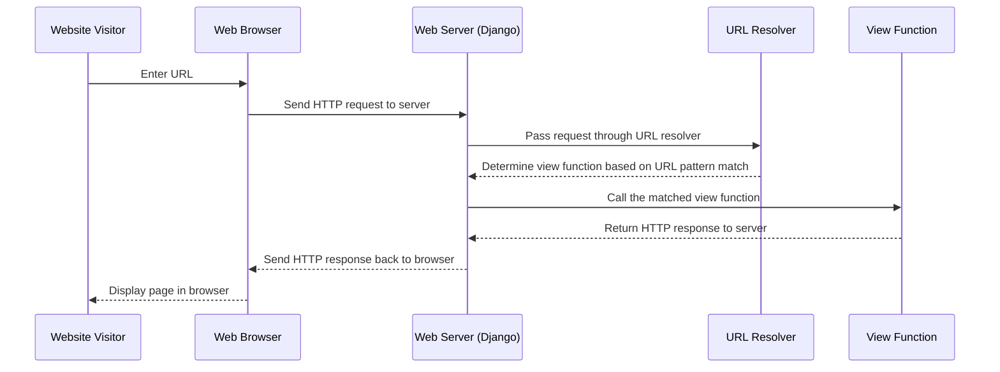

# Chapter 2: Django URLs Configuration

Welcome to your next adventure in building a Django project with `django.nV`! In [Chapter 1](01_django_settings_configuration_.md), we learned how to configure the essential settings for our Django project, like changing the database. Now, we're ready to dive into another fundamental part of any Django application: URL configuration.

## Introduction to Django URLs Configuration

Imagine you're building a website with different pages such as "Home", "About Us", and "Contact". Each of these pages needs to be uniquely identifiable so that when someone visits a specific URL, they land on the right page. In Django, this is achieved through URL configuration.

### Central Use Case: Creating Simple Page Links

Let's consider a simple use case where we want to set up two pages for our task management application:
1. **Home**: Displays an overview of tasks.
2. **About Us**: Provides information about the project.

We will define URLs that point to these pages so that when a user visits `http://localhost:8000/`, they see the home page, and when they visit `http://localhost:8000/about/`, they see the "About Us" page.

## Key Concepts

### 1. URL Patterns
URL patterns are regular expressions or simpler patterns that match the requested URLs to views.
- **Example**: `r'^$'` matches the root URL (`http://localhost:8000/`).
  
### 2. Views
Views are Python functions or classes that receive web requests and return web responses. They act as controllers in Django's MVC (Model-View-Template) architecture.
- **Example**: A view function for the home page might be `def home(request): return HttpResponse("Welcome to the Home Page!")`.

### 3. Mapping URLs to Views
We map URL patterns to views in the `urlpatterns` list.

## Setting Up URL Patterns

Let's start by setting up our URLs and linking them to their respective views.

#### Step 1: Creating Views

First, open your `views.py` file located inside your app directory (`taskManager/views.py`) and add two simple views for our pages:

```python
from django.http import HttpResponse

def home(request):
    return HttpResponse("Welcome to the Home Page!")

def about(request):
    return HttpResponse("This is the About Us page.")
```

**Explanation:** 
- `home` function returns an HTTP response saying "Welcome to the Home Page!".
- `about` function returns an HTTP response saying "This is the About Us page.".

#### Step 2: Configuring URLs

Next, we'll configure our URLs in `urls.py`. Find your main `urls.py` file located at `taskManager/urls.py`.

```python
from django.urls import path
from .views import home, about

urlpatterns = [
    path('', home, name='home'),  # URL for the Home Page
    path('about/', about, name='about'),  # URL for the About Us page
]
```

**Explanation:** 
- `path` is used to map URLs to views. We import it from `django.urls`.
- The first argument in each `path` function is the URL pattern. An empty string `''` represents the root URL.
- The second argument is the view function that should be called when this URL is accessed.
- The third argument (`name='home'`) is a name for this route, which can be used later to reverse the URL.

## Internal Implementation

To understand how Django handles URL configuration internally, let's walk through a simple sequence diagram:



**Walkthrough:** 
1. **User enters URL**: A visitor types a URL into their web browser.
2. **Request sent to server**: The browser sends an HTTP request to the Django application running on the server.
3. **URL resolver determines view function**: Django's URL resolver checks the incoming URL against the patterns defined in `urlpatterns` and finds the matching view function.
4. **View function returns response**: The view function is executed, and it returns an HTTP response.
5. **Response sent to browser**: The server sends this response back to the user's browser, which then displays the content.

### Under the Hood

Let's dive deeper into the code that makes this happen.

In `taskManager/urls.py`, we have:

```python
from django.urls import path
from .views import home, about

urlpatterns = [
    path('', home, name='home'),
    path('about/', about, name='about'),
]
```

- **Importing** the `path` function from `django.urls`.
- **Using** the `path()` function to map URL patterns to views.
- Defining two paths: one for the root URL and one for the "about" page.

Each time a request comes in, Django uses this configuration to direct the request to the appropriate view function.

## Conclusion

In this chapter, we learned how to configure URLs in Django by mapping them to specific views. We created simple views for a home page and an about us page and set up URL patterns to route requests correctly. Understanding URL configuration is crucial because it allows you to organize your application's routes efficiently.

Next, let's explore how to manage more complex routing and pass data through URLs in [Chapter 3](03_complex_url_configuration.md). Stay tuned!

---

Generated by [ScanSuite](https://scansuite.gitbook.io/scansuite)