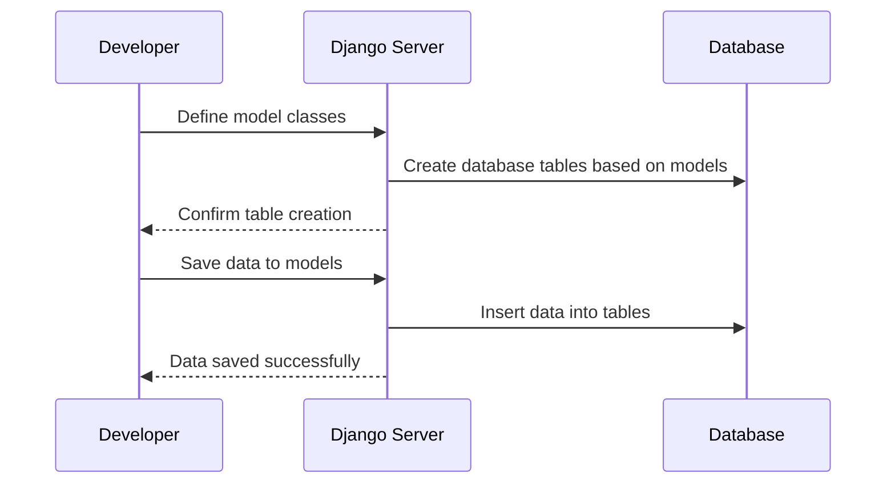

# Chapter 3: Data Modeling

Welcome to **Chapter 3** of your journey with `django.nV`! In [Chapter 2](02_django_urls_configuration_.md), we learned how to set up URLs and link them to views, which is a fundamental part of any Django application. Now, we're going to dive into another essential concept: **Data Modeling**.

## Introduction to Data Modeling

Imagine you're building a task management application where you need to keep track of projects, tasks, users, and more. Each piece of data—like project names, due dates, or user details—needs to be stored in an organized way so that your application can manage it efficiently.

In Django, **data modeling** is all about defining how this data should be structured. Models represent your data structures and map to database tables. By understanding how to create models, you'll learn how to define and organize the data for your application.

## Central Use Case

Let's start with a simple use case: creating a model for `Project`. A project has a title, description (text), start date, due date, users assigned to it, and a priority level. Here's how we can represent this in a Django model:

```python
from django.db import models
from django.contrib.auth.models import User

class Project(models.Model):
    title = models.CharField(max_length=50)
    text = models.TextField()
    start_date = models.DateTimeField('date started')
    due_date = models.DateTimeField('date due')
    users_assigned = models.ManyToManyField(User)
    priority = models.IntegerField()

    def __str__(self):
        return self.title
```

**Explanation:**
- **title**: A short name for the project (max 50 characters).
- **text**: A detailed description of the project.
- **start_date**: When the project begins.
- **due_date**: When the project is due.
- **users_assigned**: Users who are working on this project.
- **__str__ method**: Returns the title of the project, which helps identify it.

## Key Concepts

### 1. Models

Models in Django are defined as Python classes that inherit from `models.Model`. Each attribute of the class represents a field in the database table.

```python
class Project(models.Model):
    # Fields go here
```

**Explanation:**
- **Class Definition**: Defines a new model.
- **Inheritance**: Inherits from `models.Model` to specify it as a Django model.

### 2. Fields

Fields are defined within models and represent the columns in the database table. Different types of fields are available like `CharField`, `TextField`, `DateTimeField`, etc.

```python
title = models.CharField(max_length=50)
text = models.TextField()
start_date = models.DateTimeField('date started')
```

**Explanation:**
- **`CharField`**: For short text, with a maximum length specified.
- **`TextField`**: For long text.
- **`DateTimeField`**: For storing date and time information.

### 3. Relationships

Models can be linked together using relationships like `ManyToManyField`, which allows multiple instances of one model to be linked to multiple instances of another model.

```python
users_assigned = models.ManyToManyField(User)
```

**Explanation:**
- **`ManyToManyField`**: Links a project to multiple users and vice versa.

### 4. Methods

You can add custom methods to your models to perform operations on the data.

```python
def __str__(self):
    return self.title
```

**Explanation:**
- **`__str__` method**: Returns a human-readable name for the model object, useful in Django admin and logs.

## Internal Implementation

To understand how Django handles data modeling internally, let's walk through a simple sequence diagram:



**Walkthrough:**
1. **Define model classes**: You create a model class with fields and methods.
2. **Create database tables**: Django automatically creates the necessary database tables based on your model definitions.
3. **Save data to models**: You can now save, retrieve, update, or delete data using these models.
4. **Insert data into tables**: Data is stored in the corresponding database tables.

### Under the Hood

Let's dive deeper into the code that makes this happen.

In `taskManager/models.py`, we have:

```python
from django.db import models
from django.contrib.auth.models import User

class Project(models.Model):
    title = models.CharField(max_length=50)
    text = models.TextField()
    start_date = models.DateTimeField('date started')
    due_date = models.DateTimeField('date due')
    users_assigned = models.ManyToManyField(User)
    priority = models.IntegerField()

    def __str__(self):
        return self.title
```

- **Importing** `models` and `User`.
- **Defining** the `Project` model with necessary fields.
- **Creating** a relationship between `Project` and `User`.

Each time you use this model to save or retrieve data, Django handles the underlying database operations for you.

## Conclusion

In this chapter, we learned how to define models in Django to structure our application's data. We created a `Project` model with various fields and relationships, and understood how Django manages data storage internally. This is foundational for building robust applications that can efficiently handle data.

Next, let's explore how to manage more complex business logic and interactions in [Chapter 4](04_business_logic.md). Stay tuned!

---

Generated by [ScanSuite](https://scansuite.gitbook.io/scansuite)