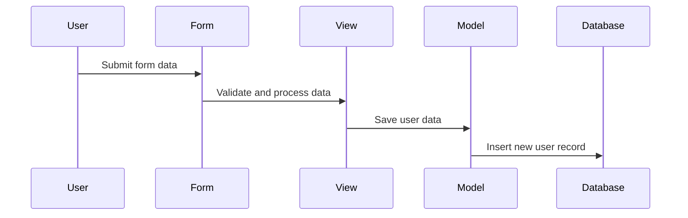

# Chapter 4: Django Forms Handling

## Transition from Previous Chapters

In [Chapter 3](03_data_models.md), we learned how to define and manage data models in Django. We created a `Project` model with various fields and relationships, which helped us structure our application's data efficiently. Now, let's take the next step by learning how to handle forms in Django. Forms play a crucial role in capturing user input through web interfaces, which we'll explore in this chapter.

## High-Level Motivation

Forms are essential for interacting with users and collecting their data. For example, consider a simple use case where you need to create a form for users to register on your website. You want to capture information like their username, email, and password. Django forms provide a robust way to manage this process by handling validation, rendering the HTML, and saving the data.

## Central Use Case

Let's start with a concrete example: creating a user registration form. We will define a form that captures the necessary details from new users and validates their input before saving it to the database.

## Key Concepts

### 1. Forms in Django

Forms in Django are defined as Python classes that inherit from `forms.Form` or `forms.ModelForm`. These classes map fields to HTML form fields and handle validation and rendering.

```python
from django import forms
from django.contrib.auth.models import User

class UserRegistrationForm(forms.ModelForm):
    class Meta:
        model = User
        fields = ['username', 'email', 'password']
```

**Explanation:**
- **Import `forms`**: Import Django's form module.
- **Inheritance**: Inherit from `ModelForm` to link the form to a model (in this case, `User`).
- **Meta class**: Specifies which fields of the model should be included in the form.

### 2. Field Types

Django provides various field types for different purposes. Some common ones are:

- **CharField**: For short text input.
- **EmailField**: For email addresses with validation.
- **PasswordInput**: For password fields that hide user input.

```python
class UserRegistrationForm(forms.ModelForm):
    class Meta:
        model = User
        fields = ['username', 'email', 'password']
        widgets = {
            'password': forms.PasswordInput()
        }
```

**Explanation:**
- **Widgets**: Customize the input widget for specific fields. Here, we use `PasswordInput` to mask the password field.

### 3. Validation

Django handles form validation automatically based on the field types and additional rules you define.

```python
def clean_email(self):
    email = self.cleaned_data.get('email')
    if User.objects.filter(email=email).exists():
        raise forms.ValidationError("This email is already in use.")
    return email
```

**Explanation:**
- **Custom validation**: Define a method to enforce additional rules. Here, we check if the email is unique.

### 4. Rendering Forms

Forms can be rendered in templates using Django's templating system.

```html
<form method="post">
    
    {{ form.as_p }}
    <button type="submit">Register</button>
</form>
```

**Explanation:**
- **CSRF Token**: Ensures the form is submitted securely.
- **`{{ form.as_p }}`**: Renders each form field wrapped in a paragraph tag.

## Using Django Forms to Solve the Use Case

### Define the Form

First, define a `UserRegistrationForm` class in `taskManager/forms.py`.

```python
from django import forms
from django.contrib.auth.models import User

class UserRegistrationForm(forms.ModelForm):
    class Meta:
        model = User
        fields = ['username', 'email', 'password']
        widgets = {
            'password': forms.PasswordInput()
        }

    def clean_email(self):
        email = self.cleaned_data.get('email')
        if User.objects.filter(email=email).exists():
            raise forms.ValidationError("This email is already in use.")
        return email
```

### Render the Form

Next, render this form in a template `registration.html`.

```html
<form method="post">
    
    {{ form.as_p }}
    <button type="submit">Register</button>
</form>
```

### Handle Form Submission

In the view, handle the form submission and validation.

```python
from django.shortcuts import render, redirect
from .forms import UserRegistrationForm

def register(request):
    if request.method == 'POST':
        form = UserRegistrationForm(request.POST)
        if form.is_valid():
            user = form.save()
            return redirect('login')
    else:
        form = UserRegistrationForm()
    return render(request, 'registration.html', {'form': form})
```

**Explanation:**
- **Check request method**: Ensure the form is submitted via POST.
- **Validate form**: Use `is_valid()` to check if the input meets all constraints.
- **Save data**: If valid, save the form data to create a new user.
- **Redirect**: Redirect the user to the login page after successful registration.

## Internal Implementation

### Walkthrough

Let's walk through what happens when a user submits the registration form.



**Explanation:**
1. **User submits form**: The user fills out the form and submits it.
2. **Form validation**: The form checks if the input is valid.
3. **Save data**: If valid, the view saves the form data as a new `User` model instance.
4. **Database insertion**: Django creates a new record in the database for the user.

### Dive Deeper

Let's dive deeper into the code responsible for this process.

**Form Definition (`forms.py`)**:

```python
class UserRegistrationForm(forms.ModelForm):
    class Meta:
        model = User
        fields = ['username', 'email', 'password']
        widgets = {
            'password': forms.PasswordInput()
        }
```

**View Handler (`views.py`)**:

```python
def register(request):
    if request.method == 'POST':
        form = UserRegistrationForm(request.POST)
        if form.is_valid():
            user = form.save()
            return redirect('login')
    else:
        form = UserRegistrationForm()
    return render(request, 'registration.html', {'form': form})
```

**Template (`registration.html`)**:

```html
<form method="post">
    
    {{ form.as_p }}
    <button type="submit">Register</button>
</form>
```

## Conclusion

In this chapter, we learned how to create and handle forms in Django. We defined a `UserRegistrationForm`, rendered it in a template, and handled its submission in the view. This process allows us to collect user input securely and save it efficiently.

Next, we will explore more complex business logic and interactions in [Chapter 5](05_business_logic.md). Stay tuned!

---

Generated by [ScanSuite](https://scansuite.gitbook.io/scansuite)