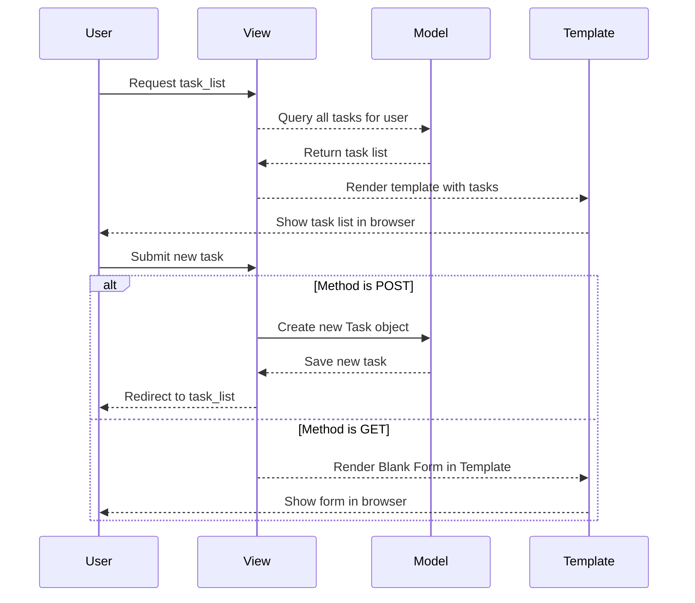

# Chapter 5: Business Logic with Views

## Transition from Previous Chapter

In [Chapter 4: Models and Databases](chapter_4.md), we learned about the models that represent the data in our application. Now, it's time to understand how users interact with this data through views.

## Motivation

Imagine you have a simple task management application where users can add and view tasks. The central problem here is how the application responds when a user wants to see their list of tasks or add a new one. This chapter will guide you through creating these responses using Django's views.

### Use Case
A typical use case is a user going to their dashboard to see all of their tasks or adding a new task. We want our application to:
1. Retrieve the user’s tasks and display them.
2. Allow the user to add new tasks.

## Key Concepts

Before diving into code, let's break down the concepts we'll be covering:

### 1. Views in Django
A view is a Python function or method that receives web requests and returns web responses. It’s responsible for returning the desired output — typically an HTML page.

### 2. Request Object
Django represents each HTTP request made to your application as a `HttpRequest` object. This object contains all information about the request, such as headers, methods (GET/POST), and URL parameters.

### 3. Response Object
A view must return an `HttpResponse` object containing the content for the response. Django provides shortcuts like `render()` that make it easy to generate responses with templates.

## Solving the Use Case

Let's tackle our motivating example by writing views to display and add tasks.

### Display Tasks

Here’s how you can create a view to list all tasks for a user:

```python
def task_list(request):
    my_tasks = Task.objects.filter(user=request.user)
    return render(request, 'tasks/task_list.html', {'task_list': my_tasks})
```

- **Explanation**: This function retrieves the tasks associated with the logged-in user and passes them to the `task_list.html` template for rendering.

### Adding a New Task

Now let's create a view that allows users to add new tasks through a form:

```python
def task_add(request):
    if request.method == 'POST':
        title = request.POST.get('title')
        description = request.POST.get('description')
        Task.objects.create(title=title, description=description, user=request.user)
        return redirect('task_list')  # Redirect to the task list page after adding a new task
    return render(request, 'tasks/task_add.html', {})
```

- **Explanation**: This function handles both GET and POST requests. For a POST request (when form data is submitted), it creates a new task using the data provided in the request. After creating the task, it redirects the user back to the task list page.

## Internal Implementation

Let's take a closer look at what happens when these views are called.

### Sequence Diagram



### Code Walkthrough

#### `task_list` View

Here's a simplified version of the `task_list()` function:

```python
def task_list(request):
    tasks = Task.objects.filter(user=request.user)
    return render(request, 'tasks/task_list.html', {'tasks': tasks})
```

- **Explanation**: This function queries all tasks for the current user using Django ORM and passes them to a template.

#### `task_add` View

Here's a simplified version of `task_add()`:

```python
def task_add(request):
    if request.method == 'POST':
        Task.objects.create(
            title=request.POST.get('title'),
            description=request.POST.get('description'),
            user=request.user)
        return redirect(task_list)
    return render(request, 'tasks/task_add.html')
```

- **Explanation**: This function creates a new task when the request method is POST and then redirects to the `task_list` view. If the method is GET, it simply renders an empty form.

## Conclusion

In this chapter, we learned how to implement views in Django to handle user interactions with data, such as displaying and adding tasks. We covered key concepts like views, requests, responses, and rendering templates. This sets the stage for building more interactive applications in future chapters.

[Next Chapter Title](chapter_6.md)

---

Generated by [ScanSuite](https://scansuite.gitbook.io/scansuite)