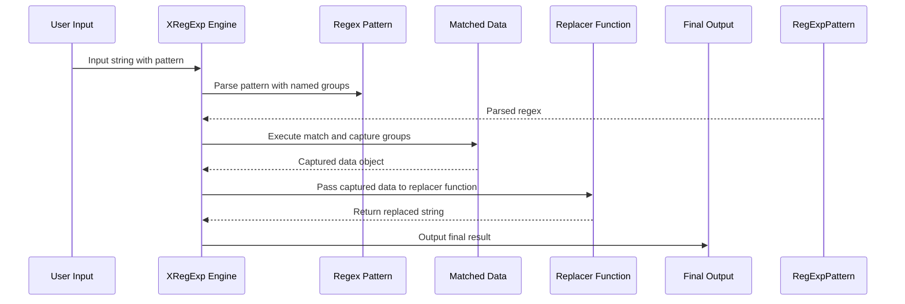

# Chapter 6: Regex Processing with XRegExp

## Transition from the Previous Chapter

In the [previous chapter](chapter5.md), we explored basic regular expressions and how they can be used to match patterns in strings. Now, let's take our regex skills to the next level by using a powerful library called **XRegExp**. This library enhances regular expressions with additional features that make them more robust and versatile.

## Motivation: Solving Real-World Problems

Imagine you're building a web application where users can enter complex search queries. You need to validate these queries, extract specific information, or perform replacements. Regular expressions alone are powerful but can be limited and tricky to manage when dealing with advanced use cases. This is where **XRegExp** comes in handy.

### Central Use Case

Let's say you want to process a user input string to ensure it contains a valid email address, name the captured groups for better readability, and handle named backreferences. Here’s how XRegExp can help:

1. **Validation**: Make sure the string follows the correct email pattern.
2. **Capturing Groups**: Use named capturing groups to extract parts of the email like username and domain.
3. **Backreferences**: Replace the domain in the captured group.

## Key Concepts Explained

### Named Capturing Groups

Named capturing groups allow you to label each part of your regex with a name, which makes it easier to reference these parts later.

**Example**: 

```regex
(?P<username>[a-zA-Z0-9]+)@(?P<domain>[a-zA-Z]+\.[a-z]{2,})
```

Here, `P` indicates a named group with the names `username` and `domain`.

### Backreferences

Backreferences allow you to match the same text as previously matched by a capturing group.

**Example**: 

```regex
(\w)\1    // Matches any character followed by itself, like 'aa' or '33'
```

In XRegExp, you can also use named backreferences.

### Custom Flags

XRegExp supports some flags not available in standard regex, like `x` for free-spacing mode and `n` for explicit capture mode.

## Using XRegExp to Solve the Use Case

Let's walk through an example using a simple email validation scenario.

### Example Input

User input:
```
john.doe@example.com
```

### Example Output

Extracted parts:
- Username: `john.doe`
- Domain: `example.com`

Replaced domain:
- New email: `john.doe@newdomain.com`

Here's how you can achieve this using XRegExp:

```js
// Define the regex pattern with named groups and free-spacing mode
const emailPattern = XRegExp(
  '(?P<username>[\\w.-]+)@(?P<domain>[A-Za-z0-9.-]+\\.[A-Za-z]{2,})',
  'x'
);

// Input string to validate and extract information from
const inputEmail = "john.doe@example.com";

// Match the pattern against the input string
let match = XRegExp.exec(inputEmail, emailPattern);

console.log(match.username); // Output: john.doe
console.log(match.domain);   // Output: example.com

// Replace the domain using a named backreference
const newDomain = "newdomain.com";
let replacedEmail = XRegExp.replace(inputEmail, emailPattern, function (match) {
  return `${match.username}@${newDomain}`;
});

console.log(replacedEmail); // Output: john.doe@newdomain.com
```

### Explanation of the Code

1. **Regex Pattern**: The pattern uses named capturing groups for `username` and `domain`. The `x` flag allows comments and free spacing.
2. **Matching**: `XRegExp.exec` matches the input string against the pattern, returning an object with captured group names.
3. **Replacement**: `XRegExp.replace` replaces the matched domain with a new one using named backreferences.

## Internal Implementation Walkthrough

### Sequence Diagram



### Code Dive

Here's a simplified view of the key parts in the `xregexp.js` library.

**Named Capturing Groups**

```js
// Part of the addToken function
add(/(?<([\w$]+)>/,
    function(match){
        this.captureNames.push(match[1]);
        return "(";
    });
```

This part adds named capture groups by recognizing the syntax `(?<name>` and storing the names in an array.

**Backreferences**

```js
// Part of the replace method
let result = inputString.replace(pattern, function(match) {
  // Named backreferences accessible via match object properties
  return match.username + "@" + newDomain;
});
```

This demonstrates how named backreferences can be accessed and used in the replacement function.

**Custom Flags**

```js
// Part of the regex parsing logic
if (this.hasFlag("x")) {
    return "[\\s\\S]";
}
```

Handling custom flags involves modifying the regex based on the provided flag `x`.

## Conclusion

In this chapter, we learned how to enhance our regex capabilities using **XRegExp**. We explored named capturing groups, backreferences, and custom flags to solve a practical use case of email validation and modification.

[Chapter 7: Advanced Regex Features](chapter7.md) will delve into more advanced features and techniques to further extend the power of regular expressions. Stay tuned!

---

Generated by [ScanSuite](https://scansuite.gitbook.io/scansuite)