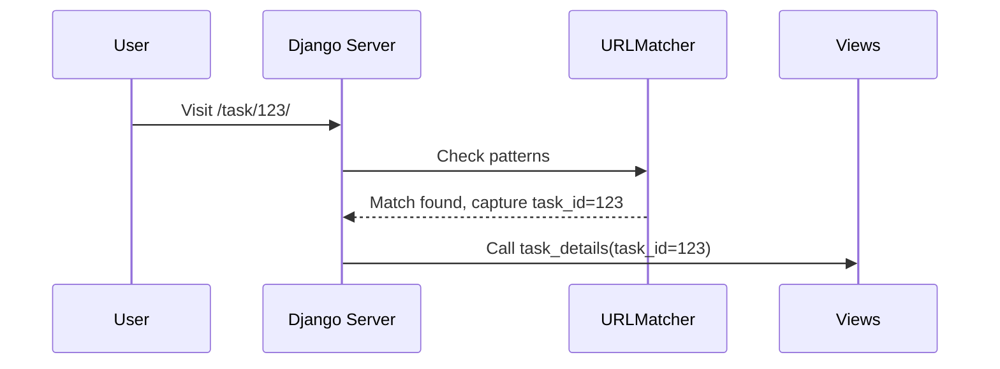

# Chapter 7: Regular Expressions in URL Patterns

## Transition from Previous Chapter

In [Chapter 6: Writing Views and Templates](chapter6.md), we learned how to create views and templates to handle user requests and display information. Now, let's take a step back and understand how Django routes these requests based on URLs.

## High-Level Motivation

When you visit a URL in a web application, Django needs to know which view should handle that request. Regular expressions (regex) help us define patterns in the URL structure so Django can map these requests correctly. For example, if you visit `http://yourapp.com/task/123/`, Django should direct this request to the view responsible for displaying details of task 123.

## Central Use Case

Imagine you have a project management app where each task has a unique ID. Instead of creating a separate URL pattern for each task, we can use regex in our URL patterns to capture these IDs dynamically and pass them to the appropriate view.

## Key Concepts

### 1. Regular Expressions (Regex)
Regex is a powerful tool for matching text based on patterns. In Django URLs, regex helps us extract parts of the URL that follow a certain pattern.

**Example:**
`r'^task/(?P<task_id>\d+)/$'`
- `^` denotes the start of the URL.
- `task/` matches exactly those characters in the URL.
- `(?P<task_id>\d+)` captures one or more digits and assigns them to a named group called `task_id`.
- `$` denotes the end of the URL.

### 2. Named Groups
Named groups allow us to capture parts of the URL and pass them as keyword arguments to the view functions.

**Example:**
In `(?P<task_id>\d+)`, `task_id` is the name of the group, and `\d+` matches one or more digits.

## Using Regex in URL Patterns

Let's use regex to create a dynamic URL pattern for our tasks. Here's how you can do it:

### Example Input/Output
- **URL:** `http://yourapp.com/task/123/`
- **Captured Value:** `task_id = 123`
- **View Function:** `views.task_details(task_id=123)`

### Code Snippet: URL Configuration

```python
# File: ./taskManager/taskManager_urls.py

from django.conf.urls import url
from taskManager import views

urlpatterns = [
    url(r'^task/(?P<task_id>\d+)/$', views.task_details, name='task_details'),
]
```

**Explanation:**
- `url()` function maps a regex pattern to a view.
- The pattern `r'^task/(?P<task_id>\d+)/$'` captures the task ID and passes it to the `task_details` view.

## Internal Implementation

### Step-by-Step Walkthrough
1. **User Request:** A user visits `http://yourapp.com/task/123/`.
2. **URL Matching:** Django checks the URL patterns for a match.
3. **Regex Capture:** The pattern matches and captures `task_id` as 123.
4. **View Handling:** Django calls `views.task_details` with `task_id=123`.

### Sequence Diagram



### Code Dive: URL Processing

```python
# File: ./taskManager/taskManager_urls.py (simplified)

from django.conf.urls import url
from taskManager import views

urlpatterns = [
    # Regex pattern capturing 'task_id'
    url(r'^task/(?P<task_id>\d+)/$', views.task_details, name='task_details'),
]
```

**Explanation:**
- `url()` function uses regex to match the URL and capture parts of it.
- `(?P<task_id>\d+)` captures one or more digits as `task_id`.

### Code Dive: View Function

```python
# File: ./taskManager/views.py (simplified)

def task_details(request, task_id):
    # Logic to fetch and display task details
    return HttpResponse(f"Details of task {task_id}")
```

**Explanation:**
- `task_id` is passed as an argument to the view function.
- The view uses this ID to fetch and display task details.

## Conclusion

In this chapter, we learned how to use regular expressions in Django URL patterns to create dynamic URLs that can capture and pass data to views. This allows for efficient handling of requests based on varying parameters like IDs.

With regex in our toolbox, we can now confidently manage more complex URL structures in our Django applications. Next, let's explore [Chapter 8: Database Models and ORM](chapter8.md) to learn how to store and retrieve data in a structured way.

---

Generated by [ScanSuite](https://scansuite.gitbook.io/scansuite)