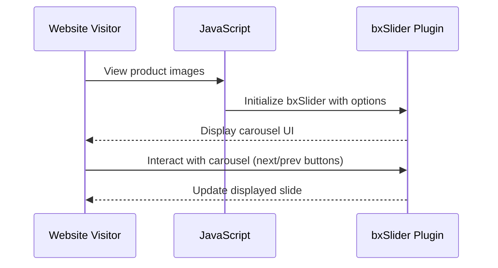

# Chapter 8: Static JavaScript for Front-end Functionality

In [Chapter 7: Static CSS for Front-end Styling](chapter_7.md), we learned how to style web pages using CSS. Now, let's dive into JavaScript to add interactive and dynamic functionality to our web applications.

## Central Use Case

Imagine you're building a simple e-commerce website where users can view product images in a carousel and see additional sidebar navigation that responds to clicks. How do you make these elements interactive? That's where JavaScript comes into play!

## Key Concepts

### 1. Tooltips
Tooltips are small pop-up boxes that provide extra information when a user hovers over an element.

**Example Code:**
```javascript
$('.tooltips').tooltip();
```
*This line initializes tooltips on any elements with the class `tooltips`.*

### 2. Popovers
Popovers are similar to tooltips but can contain more complex HTML content.

**Example Code:**
```javascript
$('.popovers').popover();
```
*This line initializes popovers on any elements with the class `popovers`.*

### 3. bxSlider
bxSlider is a jQuery plugin for responsive image carousels.

**Example Code:**
```javascript
$('.bxslider').show();
$('.bxslider').bxSlider({
    minSlides: 4,
    maxSlides: 4,
    slideWidth: 276,
    slideMargin: 20
});
```
*This code initializes a bxSlider carousel with specified settings.*

### 4. Sidebar Accordion
An accordion menu allows users to toggle the visibility of sections within a sidebar.

**Example Code:**
```javascript
$('#nav-accordion').dcAccordion({
    eventType: 'click',
    autoClose: true,
    saveState: true,
    disableLink: true,
    speed: 'slow'
});
```
*This code initializes an accordion on the element with ID `nav-accordion`.*

### 5. Slidebars
Slidebars allows for responsive, off-canvas menus and panels to be opened from any side of the page.

**Example Code:**
```javascript
$.slidebars();
```
*This line initializes slidebars functionality.*

## How to Use JavaScript for Our Use Case

Let's add interactive elements to our e-commerce website. We'll use bxSlider for a product image carousel and an accordion menu for sidebar navigation.

### Step-by-Step Implementation

#### 1. Initialize Tooltips and Popovers
Add tooltips and popovers to enhance user interactions.
```javascript
$('.tooltips').tooltip();
$('.popovers').popover();
```

#### 2. Set Up bxSlider Carousel
Create a responsive carousel for product images.
```javascript
$('.bxslider').show();
$('.bxslider').bxSlider({
    minSlides: 4,
    maxSlides: 4,
    slideWidth: 276,
    slideMargin: 20
});
```

#### 3. Add Sidebar Accordion Functionality
Enable sidebar accordion for better navigation.
```javascript
$('#nav-accordion').dcAccordion({
    eventType: 'click',
    autoClose: true,
    saveState: true,
    disableLink: true,
    speed: 'slow'
});
```

#### 4. Initialize Slidebars
Add off-canvas menus to the sidebar.
```javascript
$.slidebars();
```

## Internal Implementation

Let's walk through what happens when we call `$('.bxslider').bxSlider()`.

**Sequence Diagram:**


### Deep Dive into bxSlider Code

When `$('.bxslider').bxSlider()` is called, several steps occur:
1. The slider settings are initialized.
2. The HTML elements targeted by the class `.bxslider` are transformed into a carousel.
3. Event handlers for navigation (next, previous) are set up.

**Simplified Example:**
```javascript
$(function() {
    $('.bxslider').bxSlider({
        minSlides: 4,
        maxSlides: 4,
        slideWidth: 276,
        slideMargin: 20
    });
});
```
*This code initializes `.bxslider` elements into a responsive carousel with specified dimensions and spacing.*

### Conclusion

In this chapter, we learned how to use JavaScript libraries like bxSlider, tooltips, popovers, accordion menus, and slidebars to make web pages more interactive. By following our simple examples, you can add engaging features to your websites.

In [Chapter 9: Introduction to AJAX for Dynamic Content](chapter_9.md), we'll explore how to update content dynamically without reloading the page using AJAX. Stay tuned!

---

Generated by [ScanSuite](https://scansuite.gitbook.io/scansuite)