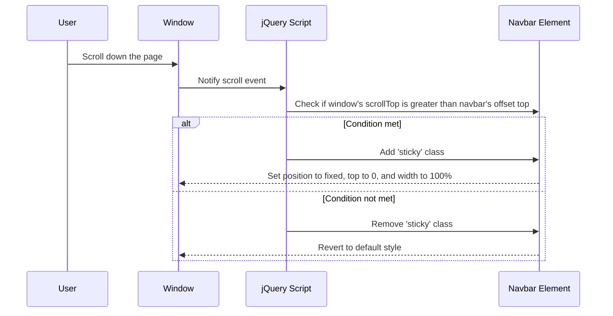

# Chapter 9: JavaScript Libraries

## Transition from Previous Chapter
In the previous chapter, [Chapter 8: Introduction to JavaScript](chapter_8.md), we learned the basics of JavaScript and how to manipulate HTML elements using JavaScript. Now, let's take it a step further by exploring how JavaScript libraries can simplify our work.

## Motivation
Imagine you're building a website and want to add some interactive pop-ups or make your navigation bar sticky as you scroll. While you could write all the necessary JavaScript code from scratch, doing so would be time-consuming and error-prone. This is where JavaScript libraries come in handy. They provide pre-written, tested, and efficient code that allows us to accomplish these tasks with minimal effort.

### Central Use Case
Our central use case will be adding a sticky navigation bar to our website using the jQuery library. A sticky navigation bar remains at the top of the page even when you scroll down, which enhances user experience. Instead of writing complex JavaScript code, we'll leverage jQuery's simplicity and built-in functions.

## Key Concepts

### 1. JavaScript Libraries
A JavaScript library is a collection of pre-written code that provides useful functions and methods to simplify web development tasks. By using libraries, developers can save time and reduce the complexity of their code. Example libraries include jQuery, Bootstrap, and React.js.

### 2. jQuery
jQuery is one of the most popular JavaScript libraries, known for its simplicity and ease of use. It simplifies HTML document traversing, event handling, animating, and Ajax interactions for rapid web development. For our example, we'll focus on using jQuery to create a sticky navigation bar.

## Using jQuery to Solve the Use Case

### Step 1: Include jQuery in Your Project
To use jQuery, you need to include it in your HTML file by adding a `<script>` tag that points to the jQuery CDN (Content Delivery Network).

```html
<!-- Include jQuery from a CDN -->
<script src="https://ajax.googleapis.com/ajax/libs/jquery/3.5.1/jquery.min.js"></script>
```

*Explanation*: This line loads the jQuery library, making its functions available for use in our scripts.

### Step 2: Write the HTML for the Sticky Navigation Bar
Let's create a simple navigation bar that we'll make sticky later.

```html
<nav id="navbar">
  <ul>
    <li><a href="#home">Home</a></li>
    <li><a href="#about">About</a></li>
    <li><a href="#services">Services</a></li>
    <li><a href="#contact">Contact</a></li>
  </ul>
</nav>
```

*Explanation*: This HTML snippet creates a basic navigation bar with links to different sections of the website.

### Step 3: Write CSS for the Navigation Bar
Add some basic styling to make the navigation bar look nice and distinguishable.

```css
#navbar {
  position: relative; /* Default position */
  background-color: #333;
  color: white;
  padding: 10px;
}

#navbar a {
  color: white;
  text-decoration: none;
  margin-right: 15px;
}
```

*Explanation*: The CSS styles the navigation bar with a dark background and white colored links. Initially, it's positioned relatively.

### Step 4: Write jQuery to Make the Navigation Bar Sticky
Now, let's use jQuery to change the position of the navigation bar when we scroll down past its initial position.

```html
<script>
$(document).ready(function() {
    var navbarOffset = $('#navbar').offset().top;

    $(window).scroll(function() {
        if ($(window).scrollTop() > navbarOffset) {
            $('#navbar').addClass('sticky');
        } else {
            $('#navbar').removeClass('sticky');
        }
    });
});
</script>
```

*Explanation*: 
- `$(document).ready()` ensures that the code runs only after the document is fully loaded.
- We determine the initial position of the navbar with `$('#navbar').offset().top`.
- As we scroll, when the distance scrolled exceeds this offset, we add a 'sticky' class to the navbar.

### Step 5: Add CSS for the Sticky Class
Define what happens to the navbar when it becomes sticky.

```css
.sticky {
    position: fixed;
    top: 0;
    width: 100%;
}
```

*Explanation*: The 'sticky' class changes the position of the navbar to fixed, keeping it at the top, and sets its width to 100% so it spans the entire page.

## Internal Implementation Walkthrough

### Non-Code Walkthrough
Here's a step-by-step sequence diagram to understand how the jQuery script works:



*Explanation*: As the user scrolls, the window notifies the jQuery script of scroll events. If the vertical scroll position exceeds the navbar's initial offset, the 'sticky' class is added, making it fixed at the top. Otherwise, it reverts to its default relative positioning.

### Code Walkthrough
Here's a simplified walkthrough of the jQuery code:

```javascript
$(document).ready(function() {
    // Store the initial position of the navbar
    var navbarOffset = $('#navbar').offset().top;

    // Listen for scroll events on the window
    $(window).scroll(function() {
        // Compare current scroll position to navbar's offset
        if ($(window).scrollTop() > navbarOffset) {
            // Add sticky class when condition is met
            $('#navbar').addClass('sticky');
        } else {
            // Remove sticky class otherwise
            $('#navbar').removeClass('sticky');
        }
    });
});
```

*Explanation*: 
- The script waits for the document to load fully.
- It stores the initial vertical position of the navbar where `offset().top` returns the distance of the navbar from the top of the page.
- A scroll event listener is attached to trigger our function whenever scrolling occurs.
- Inside this function, we compare the current scroll position (`scrollTop()`) against stored offset. Based on comparison results, respective classes are added or removed on the navbar.

## Conclusion
In this chapter, we learned how JavaScript libraries like jQuery can simplify complex web development tasks, such as creating interactive sticky navigation bars. By following our step-by-step guide, you should now be able to apply jQuery in your own projects to enhance user interactions and improve your websites' functionality.

Ready to take on more dynamic web features? In [Chapter 10: Advanced CSS and JavaScript](chapter_10.md), we'll dive deeper into advanced CSS properties and additional JavaScript techniques to build even more impressive interfaces.

---

Generated by [ScanSuite](https://scansuite.gitbook.io/scansuite)