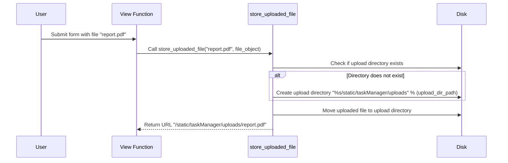

# Chapter 10: Miscellaneous Helper Functions

## Transition from Previous Chapters
In [Chapter 9: Advanced CSS and JavaScript](chapter_9.md), we explored advanced CSS properties and additional JavaScript techniques to build impressive web interfaces. In this chapter, we'll dive into some miscellaneous helper functions that simplify common tasks in web applications. These functions are useful for handling file uploads, data processing, and more.

## High-Level Motivation
Suppose you're building a task management application where users can upload files as part of their tasks. You need to handle these file uploads efficiently and securely. One of the functions in `misc.py` helps with storing uploaded files on disk. By using this helper function, you can avoid common pitfalls like race conditions and incorrect file paths.

## Central Use Case
Let's start with a concrete example. Imagine you're building a task manager where users can attach files to their tasks. You need a robust way to store these files on the server. The `store_uploaded_file` function in `misc.py` does exactly that.

### Key Concepts

1. **File Handling**: Efficiently handling file uploads without causing race conditions.
2. **Directory Management**: Ensuring that the upload directory exists before saving files.
3. **Security**: Avoiding security issues like shell injection while moving files.

## How to Use the `store_uploaded_file` Function
Let's explore how to use this function in a simple example. The function takes two parameters: `title`, which is the name of the file, and `uploaded_file`, which is the file object from a form submission.

### Example Inputs
- `title`: "report.pdf"
- `uploaded_file`: A file object representing "report.pdf"

### Example Code

```python
from django_nV.taskManager.misc import store_uploaded_file

def handle_task_creation(request):
    if request.method == 'POST' and request.FILES['document']:
        document = request.FILES['document']
        file_url = store_uploaded_file(document.name, document)
        print("File uploaded successfully:", file_url)
```

### Explanation
- When a user submits a form with an attached file, we retrieve the file using `request.FILES['document']`.
- We then call `store_uploaded_file` with the file's name and the file object. This function processes the file and returns a URL where it can be accessed.
- Finally, we print a success message along with the file URL.

## Internal Implementation Walkthrough

### Non-Code Walkthrough
Let's break down how the function works step-by-step using a simple sequence diagram:



### Code Dive

#### Step 1: Checking and Creating the Upload Directory
This part ensures that the destination directory exists before moving the file.

```python
upload_dir_path = '%s/static/taskManager/uploads' % (
    os.path.dirname(os.path.realpath(__file__)))
if not os.path.exists(upload_dir_path):
    os.makedirs(upload_dir_path)
```

*Explanation*: 
- We define the path to the upload directory.
- If the directory doesn't exist, we create it using `os.makedirs`.

#### Step 2: Moving the Uploaded File
This part moves the file from its temporary location to the upload directory.

```python
# A1: Injection (shell)
os.system(
    "mv " +
    uploaded_file.temporary_file_path() +
    " " +
    "%s/%s" %
    (upload_dir_path,
     title))
```

*Explanation*: 
- Using `os.system`, we execute a shell command to move the file from its temporary location (`uploaded_file.temporary_file_path()`) to the upload directory.
- This step contains a security vulnerability (shell injection), so in practice, you should avoid using `os.system` for file operations. Instead, use higher-level libraries like `shutil`.

#### Step 3: Returning the File URL
This part returns the URL where the uploaded file can be accessed.

```python
return '/static/taskManager/uploads/%s' % (title)
```

*Explanation*: 
- We return a string representing the URL of the uploaded file, which can be used to access it later.

## Conclusion
In this chapter, you learned about miscellaneous helper functions in `misc.py`, specifically how to use the `store_uploaded_file` function to handle file uploads securely and efficiently. By understanding how these functions work under the hood, you can write more robust and secure web applications.

Ready to make your task manager even better? In [Chapter 11: User Authentication](chapter_11.md), we'll explore how to add user authentication to your application, ensuring that only authorized users can access certain features.

---

Generated by [ScanSuite](https://scansuite.gitbook.io/scansuite)