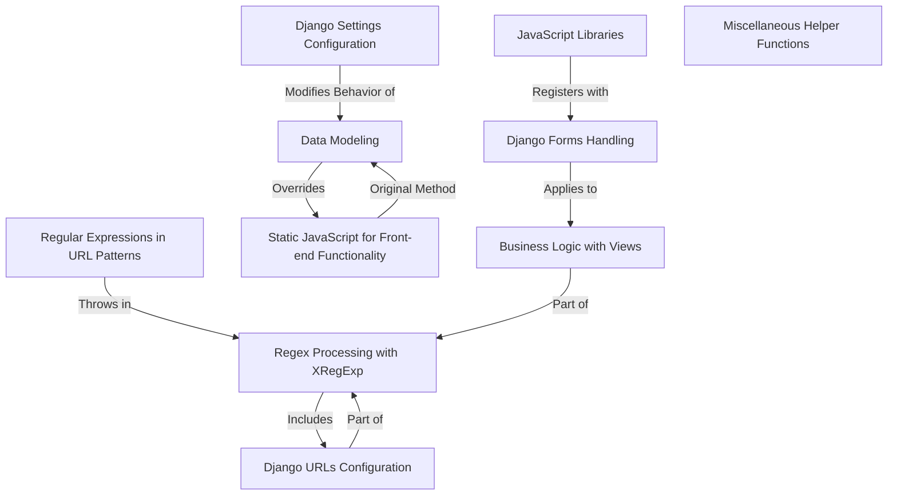

# Tutorial: django.nV

**XRegExp** is an advanced JavaScript library that *extends* native RegExp functionality. It provides support for additional regex features like named backreferences and more readable syntax through free-spacing mode. This allows users to create powerful, maintainable regular expressions.

**Source Repository:** [None](None)

## Chapters

1. [Django Settings Configuration
](01_django_settings_configuration_.md)
2. [Django URLs Configuration
](02_django_urls_configuration_.md)
3. [Data Modeling
](03_data_modeling_.md)
4. [Django Forms Handling
](04_django_forms_handling_.md)
5. [Business Logic with Views
](05_business_logic_with_views_.md)
6. [Regex Processing with XRegExp
](06_regex_processing_with_xregexp_.md)
7. [Regular Expressions in URL Patterns
](07_regular_expressions_in_url_patterns_.md)
8. [Static JavaScript for Front-end Functionality
](08_static_javascript_for_front_end_functionality_.md)
9. [JavaScript Libraries
](09_javascript_libraries_.md)
10. [Miscellaneous Helper Functions
](10_miscellaneous_helper_functions_.md)

---

Generated by [ScanSuite](https://scansuite.gitbook.io/scansuite)