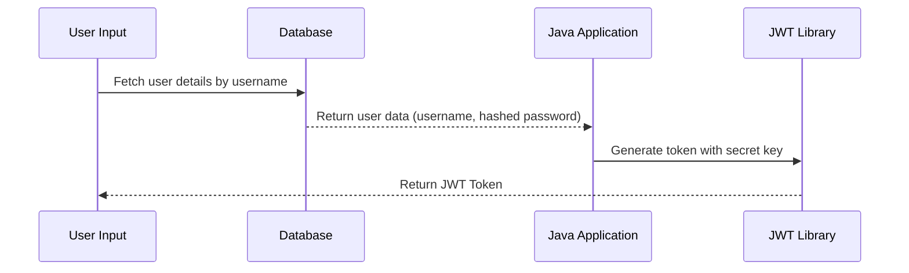

# Chapter 1: User Authentication

Welcome to the first chapter of our `java-ai` project tutorial! In this section, we are going to explore the concept of **User Authentication**. Think of it as ensuring that only authorized people can access certain parts of an application, much like how a bouncer at a club checks IDs before letting people in.

## Motivation

Imagine you're building a simple app where users have accounts and can log in to see personalized information. You need a way to verify that someone trying to log in is who they say they are—just like how a bouncer ensures guests have valid IDs.

## Key Concepts of User Authentication

1. **User Identification**: This involves gathering user details, such as their username.
2. **Password Verification**: Ensures that the password provided matches what's stored securely for that user.
3. **Session Management**: Keeps track of an authenticated user’s session to ensure they can continue accessing the app without having to log in each time.

## Solving Our Use Case: Logging In a User

To solve our use case, we need to take input from the user (username and password), verify it against what's stored, and then allow access if everything checks out.

### Example Usage

Let’s see an example of how this might look:

```java
User user = User.fetch("john_doe");
String secretKey = "superSecret!";
if (user != null && user.hashedPassword.equals(userProvidedHash)) {
    String token = user.token(secretKey);
    System.out.println("Authentication successful! Here’s your JWT Token: " + token);
} else {
    System.out.println("Authentication failed.");
}
```

**Explanation**:
- `User.fetch("john_doe")` retrieves the user details from the database.
- We then check if the password provided matches the hashed password stored.
- If they match, we generate a JWT token for the user.
- Otherwise, authentication fails.

## Internal Implementation

### Step-by-Step Process

1. **Fetch User Data**: Fetch user data from the database using the username.
2. **Verify Password**: Compare the provided password with the stored hashed password.
3. **Generate Token**: Create a JSON Web Token (JWT) if authentication is successful for session management.



### Step-by-Step Code Walkthrough

#### **Fetching User Data**

```java
public static User fetch(String un) {
    // Create a SQL query to find the user by username.
    String query = "select * from users where username = '" + un + "' limit 1";
    ResultSet rs = stmt.executeQuery(query);
    
    // Extract data and create a new User object if found.
    if (rs.next()) {
        return new User(rs.getString("user_id"), rs.getString("username"), rs.getString("password"));
    }
}
```

**Explanation**: We use a SQL query to find the user in the database. If we find one, we create a `User` object with their details.

#### **Password Verification**

```java
if (user.hashedPassword.equals(userProvidedHash)) {
    // Proceed if the hashed password matches.
}
```

**Explanation**: We check if the provided password hash matches the stored hashed password in the database.

#### **Generating JWT Token**

```java
public String token(String secret) {
    SecretKey key = Keys.hmacShaKeyFor(secret.getBytes());
    return Jwts.builder().setSubject(this.username).signWith(key).compact();
}
```

**Explanation**: We use the `Jwts` class to create a JWT token with the user's username and a secret key for signing.

## Conclusion

In this chapter, we learned about **User Authentication**, which is essential for verifying that users are who they claim to be. We walked through how to authenticate a user, fetch their data from a database, verify their password, and generate a JWT token for session management.

Next, we'll dive into understanding [JWT Token Management](02_jwt_token_management_.md) to explore more about handling these tokens that the users will use to maintain their sessions.

---

Generated by [ScanSuite](https://scansuite.gitbook.io/scansuite)