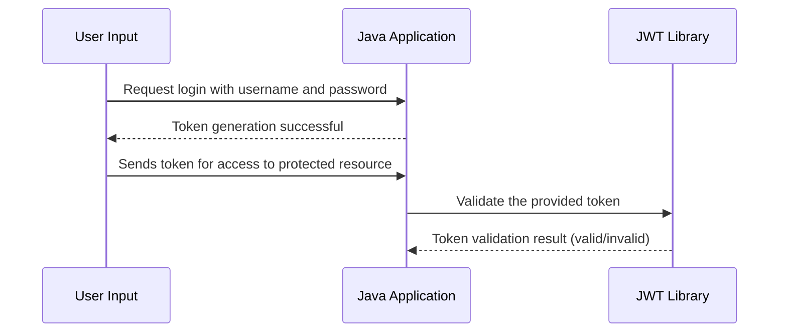

# Chapter 2: JWT Token Management

Welcome to Chapter 2 of our `java-ai` project tutorial! In [Chapter 1: User Authentication](01_user_authentication_.md), we learned how to authenticate users by verifying their usernames and passwords. Once authenticated, we generate a special piece of information called a JSON Web Token (JWT) that helps us manage user sessions.

### Motivation

Think of JWT tokens like tickets you get at an amusement park. When you enter the park, you show your ticket to each ride or attraction to prove you’re allowed in. Similarly, in our app, once users log in, we give them a JWT token to show that they are authenticated for future requests.

### Key Concepts of JWT Token Management

1. **Token Creation**: Generating a JWT token when a user successfully logs in.
2. **Token Validation**: Verifying the JWT token received from a request to ensure it’s valid and hasn’t been tampered with.

### Solving Our Use Case: Managing User Sessions with Tokens

Let's see an example of how this works in our `java-ai` project:

#### Generating a JWT Token

```java
String secretKey = "superSecret!";
String token = user.token(secretKey);
System.out.println("JWT Token: " + token);
```

**Explanation**:
- We use a `secretKey` to sign the JWT.
- The `user.token(secretKey)` method generates the JWT token.

#### Validating a JWT Token

```java
try {
    User.assertAuth(secretKey, token);
    System.out.println("Token is valid.");
} catch (Unauthorized e) {
    System.out.println("Invalid token.");
}
```

**Explanation**:
- `User.assertAuth(secretKey, token)` checks if the token is valid.
- If valid, it prints a success message; otherwise, it catches an exception and handles invalid tokens.

### Internal Implementation

#### Step-by-Step Process

1. **Generate Token**: Use the provided secret key to create a JWT token with user details.
2. **Sign Token**: Sign the token to ensure its integrity and authenticity.
3. **Validate Token**: Verify the signature of the received token to confirm it matches.



#### Step-by-Step Code Walkthrough

##### **Generating Token**

```java
public String token(String secret) {
    SecretKey key = Keys.hmacShaKeyFor(secret.getBytes());
    return Jwts.builder().setSubject(this.username).signWith(key).compact();
}
```

**Explanation**:
- `SecretKey key` creates a secure key using the provided secret.
- `Jwts.builder()` initializes the JWT builder.
- `.setSubject(this.username)` sets the username as the subject of the token.
- `.signWith(key)` signs the token with our secret key.
- `.compact()` compacts and returns the final JWT token.

##### **Validating Token**

```java
public static void assertAuth(String secret, String token) {
    try {
        SecretKey key = Keys.hmacShaKeyFor(secret.getBytes());
        Jwts.parser().setSigningKey(key).parseClaimsJws(token);
    } catch(Exception e) {
        throw new Unauthorized(e.getMessage());
    }
}
```

**Explanation**:
- `SecretKey key` creates the same secure key used during token generation.
- `Jwts.parser()` initializes the JWT parser.
- `.setSigningKey(key)` sets our secret key for parsing.
- `.parseClaimsJws(token)` validates and parses the token.
- If an exception occurs, it means the token is invalid.

### Conclusion

In this chapter, we explored **JWT Token Management**, which helps manage user sessions securely in our app. We learned how to generate JWT tokens upon successful logins and validate these tokens for future requests. Next, we'll tackle [User Object Representation](03_user_object_representation_.md) to understand how user data is structured and handled within the application.

---

Generated by [ScanSuite](https://scansuite.gitbook.io/scansuite)