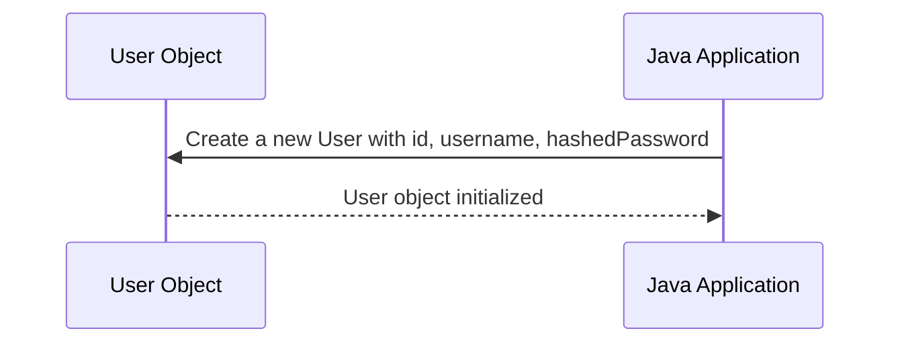

# Chapter 3: User Object Representation

Welcome to Chapter 3 of our `java-ai` project tutorial! In [Chapter 2](02_jwt_token_management_.md), we learned about managing user sessions using JSON Web Tokens (JWT). Once a user is authenticated, we generate and validate JWT tokens. But before we can handle these tokens effectively, we need to understand how user data is structured in our application.

### Motivation

Imagine you're building an app where users have accounts. Each user should be uniquely identified by their username and password. However, storing passwords directly is not safe due to security risks. Instead, we store a hashed version of the password. So, when a user logs in, we need a way to represent this user's data in our application—like keeping everything organized in your locker.

### Key Concepts of User Object Representation

1. **User Properties**: Every user has details like `id`, `username`, and `hashedPassword`. Think of these as the important labels you put on different items in your locker.
2. **Object Creation**: We create user objects to represent this data, much like how you organize your clothes or books into specific boxes.

### Solving Our Use Case: Representing User Data

Let's see an example of how we can represent a user in our `java-ai` project:

#### Creating a User Object

```java
User user = new User("1", "john_doe", "hashed_password_123");
```

**Explanation**:
- We create a new `User` object with an `id`, `username`, and `hashedPassword`.
- This is similar to putting clothes in separate compartments in your locker.

### Internal Implementation

#### Step-by-Step Process

1. **Define User Properties**: Specify the properties like `id`, `username`, and `hashedPassword`.
2. **Create Constructor**: Write a constructor to initialize these properties for new user objects.
3. **Use Object**: Use this object to manage user data, such as authenticating and generating tokens.



#### Step-by-Step Code Walkthrough

##### **Defining Properties**

```java
public String id, username, hashedPassword;
```

**Explanation**:
- These lines define the properties of a `User`. They are like labels for different items in your locker.

##### **Creating Constructor**

```java
public User(String id, String username, String hashedPassword) {
    this.id = id;
    this.username = username;
    this.hashedPassword = hashedPassword;
}
```

**Explanation**:
- This constructor initializes the properties of a `User` object.
- It's like setting up your locker with specific items.

##### **Using Object**

```java
User user = new User("1", "john_doe", "hashed_password_123");
```

**Explanation**:
- We create a new `User` object with the given details.
- This helps us manage and track each user in our application efficiently.

### Conclusion

In this chapter, we learned about **User Object Representation**, which is crucial for structuring user data in our application. We learned how to represent users as objects with properties like `id`, `username`, and `hashedPassword`. We also walked through creating user objects and using them effectively. 

Next, we'll dive into [SQL Query Execution](04_sql_query_execution_.md) to understand how these user objects interact with the database.

---

Generated by [ScanSuite](https://scansuite.gitbook.io/scansuite)