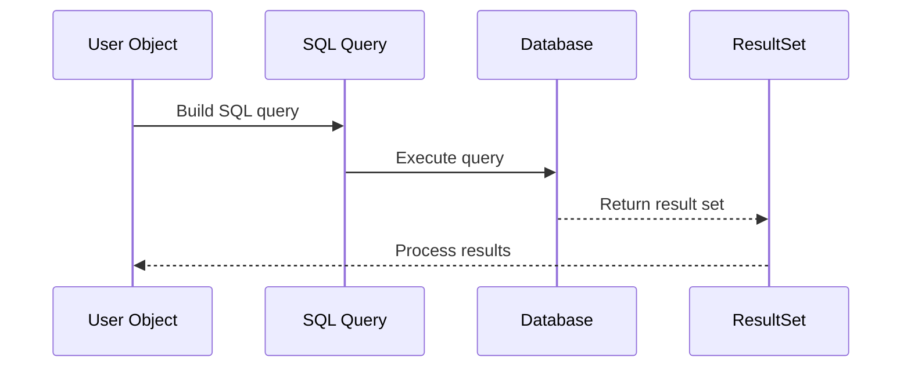

# Chapter 4: SQL Query Execution

Welcome to Chapter 4 of our `java-ai` project tutorial! In [Chapter 3: User Object Representation](03_user_object_representation_.md), we learned how user data is structured and organized within the application. Now, it's time to understand how we can interact with the database to retrieve or modify this data using SQL queries.

### Motivation

Imagine you have a library of books, and you want to find a specific book by its title or author. You wouldn't search through every single book manually; instead, you would use a catalog system that allows you to quickly find what you're looking for. Similarly, in our application, we need a way to efficiently retrieve or modify data stored in the database—this is where SQL queries come into play.

### Key Concepts of SQL Query Execution

1. **SQL Queries**: These are commands used to communicate with the database. It's like giving instructions to the kitchen staff at a restaurant.
2. **Executing Queries**: We send these instructions (queries) to the database and receive results based on our requests.

### Solving Our Use Case: Retrieving User Data

Let's see an example of how we can retrieve user data using SQL queries in our `java-ai` project.

#### Example Usage

Suppose we want to fetch a user by their username. Here’s how it would look:

```java
String un = "john_doe";
String query = "select * from users where username = '" + un + "' limit 1";
ResultSet rs = stmt.executeQuery(query);
```

**Explanation**:
- We define the `un` variable with the desired username.
- We construct a SQL query to select the user from the `users` table where the `username` matches `un`.
- We execute this query using `stmt.executeQuery(query)` and get the result in `rs`.

### Internal Implementation

#### Step-by-Step Walkthrough

1. **Construct Query**: We build the SQL query string based on our requirements.
2. **Create Statement**: We create a statement object to send the query to the database.
3. **Execute Query**: We execute the query and get a result set.
4. **Process Results**: We process the results from the database.



#### Detailed Code Walkthrough

##### Constructing the Query

```java
String un = "john_doe";
String query = "select * from users where username = '" + un + "' limit 1";
```

**Explanation**:
- We define the `un` variable with the desired username.
- We construct a SQL query to select the user from the `users` table where the `username` matches `un`.

##### Creating and Executing the Statement

```java
Statement stmt = cxn.createStatement();
ResultSet rs = stmt.executeQuery(query);
```

**Explanation**:
- We create a statement object using the connection `cxn`.
- We execute the query using `stmt.executeQuery(query)` and get the result in `rs`.

##### Processing Results

```java
if (rs.next()) {
    String user_id = rs.getString("user_id");
    String username = rs.getString("username");
    String password = rs.getString("password");
    user = new User(user_id, username, password);
}
```

**Explanation**:
- We check if there is a next row in the result set `rs`.
- If there is a matching record, we extract the `user_id`, `username`, and `hashedPassword` from the result set.
- We create a new `User` object with these details.

### Conclusion

In this chapter, we learned about **SQL Query Execution**—how to construct and execute SQL queries to interact with the database. We saw how to retrieve user data by username as a concrete example. It's like giving a specific task to a kitchen staff member and getting back the desired result.

Next, we'll dive into [Static Methods and Utility Classes](next_chapter_filename) to understand how common functionalities are organized and reused within our application.

---

Generated by [ScanSuite](https://scansuite.gitbook.io/scansuite)