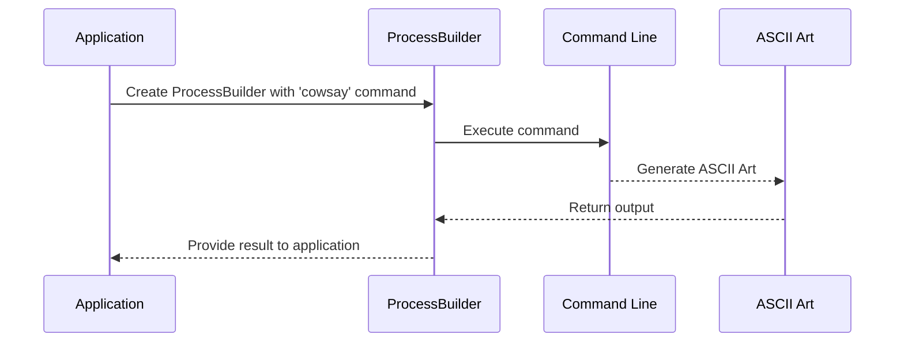

# Chapter 5: Command Line Interface (CLI) Execution

Welcome to Chapter 5 of our tutorial! In [Chapter 4: SQL Query Execution](04_sql_query_execution_.md), we learned how to retrieve and manipulate data in the database using SQL queries. Now, let's dive into executing commands through the command line interface (CLI). This is a fundamental skill that will allow us to interact with system tools and utilities programmatically.

### Motivation

Imagine you have a tool like `cowsay` on your computer, which generates ASCII art of a cow saying something. Instead of running it manually in the terminal, we want our application to run this tool for us automatically. This is where executing commands through the CLI comes into play. For example, if we want to generate an ASCII art of a cow saying "Hello, World!" and use its output in our application, we need to execute `cowsay` programmatically.

### Key Concepts

1. **Command Line Interface (CLI)**: This is a text-based interface that allows users to interact with the system by typing commands. Think of it as talking directly to your computer using the keyboard.
2. **ProcessBuilder**: This is a class in Java that allows us to execute external programs, like commands in the command line, within our application.

### Solving the Use Case

Let's see how we can use `ProcessBuilder` to run the `cowsay` command and get its output.

#### Example Usage

Suppose we want to generate an ASCII art of a cow saying "Hello, World!" Here’s how we would do it:

```java
String input = "Hello, World!";
String result = Cowsay.run(input);
System.out.println(result);
```

**Explanation**:
- We define the `input` variable with the text we want the cow to say.
- We call the `Cowsay.run` method with this input to generate the ASCII art.
- We print the result, which will be the ASCII art of a cow.

### Internal Implementation

#### Step-by-Step Walkthrough

1. **Define Input**: We define the string that we want to pass to the `cowsay` command.
2. **Create ProcessBuilder**: We create a `ProcessBuilder` object that sets up and runs the command.
3. **Build Command**: We construct the command as a string and set it in the `ProcessBuilder`.
4. **Execute Command**: We start the process using `processBuilder.start()`, which executes the command.
5. **Capture Output**: We capture the output of the command, which is the ASCII art generated by `cowsay`.



#### Detailed Code Walkthrough

##### Define Input

```java
String input = "Hello, World!";
```

**Explanation**:
- We define the `input` variable with the text we want the cow to say.

##### Create and Configure ProcessBuilder

```java
ProcessBuilder processBuilder = new ProcessBuilder();
String cmd = "/usr/games/cowsay '" + input + "'";
processBuilder.command("bash", "-c", cmd);
```

**Explanation**:
- We create a `ProcessBuilder` object.
- We construct the command string that we want to execute.
- We set this command in the `ProcessBuilder`.

##### Execute Command and Capture Output

```java
StringBuilder output = new StringBuilder();

try {
    Process process = processBuilder.start();
    BufferedReader reader = new BufferedReader(new InputStreamReader(process.getInputStream()));

    String line;
    while ((line = reader.readLine()) != null) {
        output.append(line + "\n");
    }
} catch (Exception e) {
    e.printStackTrace();
}
```

**Explanation**:
- We start the process using `processBuilder.start()`.
- We read the output of the command from `process.getInputStream()` using a `BufferedReader`.
- We append each line of the output to a `StringBuilder`.

##### Return Output

```java
return output.toString();
```

**Explanation**:
- Finally, we return the captured output as a string.

### Conclusion

In this chapter, we learned about **Command Line Interface (CLI) Execution**, how to use `ProcessBuilder` in Java to execute external commands, and how to capture their outputs. We saw a practical example of generating ASCII art using the `cowsay` command. This skill will be useful for interacting with system tools and utilities programmatically.

Next, we'll explore [Static Methods and Utility Classes](05_static_methods_and_utility_classes.md) to understand how common functionalities are organized and reused within our application.

---

Generated by [ScanSuite](https://scansuite.gitbook.io/scansuite)