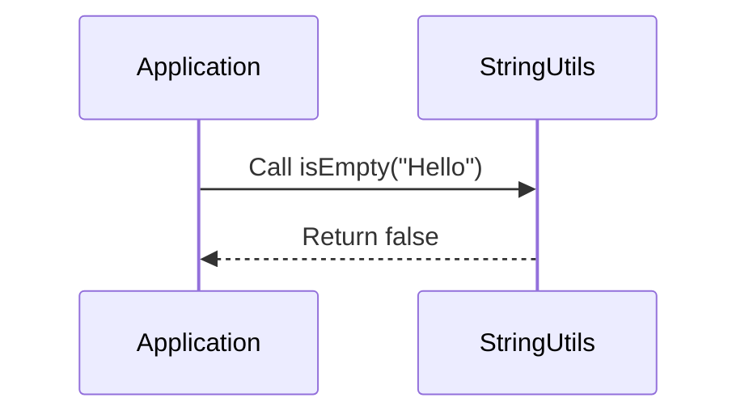

# Chapter 6: Static Methods and Utility Classes

Welcome to **Chapter 6**! In [Chapter 5: Command Line Interface (CLI) Execution](05_cli_execution.md), we learned how to execute external commands through the command line interface using `ProcessBuilder`. This was useful for running system tools like `cowsay` directly from our application. Now, let's dive into **Static Methods and Utility Classes**.

### Motivation

Imagine you have a bunch of helper functions that perform common tasks—like checking if an email is valid or converting temperatures from Celsius to Fahrenheit. It would be nice if we could group these functions together so they can be easily reused across different parts of our application without needing to create instances of classes. This is where **static methods and utility classes** come in.

### Key Concepts

1. **Static Methods**: A method that belongs to a class rather than an instance of the class. You can call it without creating an object of the class.
2. **Utility Classes**: A class that contains only static methods and is meant to be used for its helper functions. Think of it as a toolbox with different tools (methods).

### Using Static Methods and Utility Classes

Let's create a simple utility class called `StringUtils` with a few static methods:

#### Example Usage

Suppose we want to check if a string is empty or not.

```java
boolean isEmpty = StringUtils.isEmpty("Hello");
System.out.println(isEmpty); // false
```

**Explanation**:
- We call the `isEmpty` method from `StringUtils` without creating an instance of `StringUtils`.
- The method returns `false` because the string "Hello" is not empty.

### Internal Implementation

#### Step-by-Step Walkthrough

1. **Define the Utility Class**: Create a class called `StringUtils`.
2. **Add Static Methods**: Add static methods like `isEmpty`, `reverse`, etc.
3. **Call Methods Directly**: Access these methods directly from other classes.



#### Detailed Code Walkthrough

##### Define the Utility Class

```java
public class StringUtils {
  // Private constructor to prevent instantiation
  private StringUtils() {}

  // Static method to check if a string is empty
  public static boolean isEmpty(String str) {
    return str == null || str.isEmpty();
  }

  // Example of another static method: reverse a string
  public static String reverse(String str) {
    return new StringBuilder(str).reverse().toString();
  }
}
```

**Explanation**:
- We define the `StringUtils` class with private constructor to prevent instantiation.
- The `isEmpty` method checks if the input string is null or empty and returns a boolean.
- The `reverse` method reverses the input string using `StringBuilder`.

### Conclusion

In this chapter, we learned about **Static Methods and Utility Classes**—how to organize common functionalities into utility classes with static methods that can be easily reused. We saw examples of how to check if a string is empty and how to reverse a string.

Next, let's explore [Error Handling in Java](06_error_handling.md) to understand how to handle exceptions and errors properly within our applications.

---

Generated by [ScanSuite](https://scansuite.gitbook.io/scansuite)