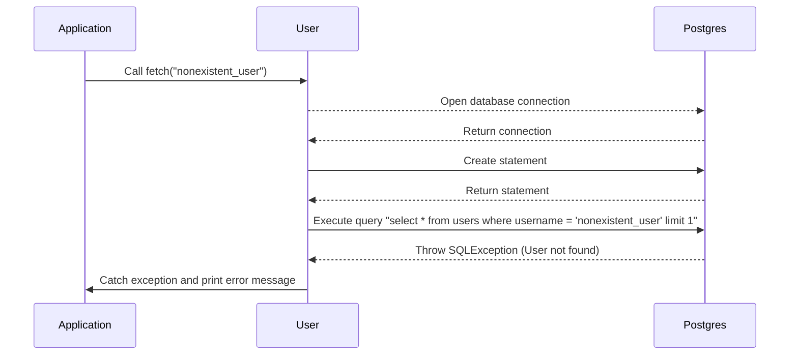

# Chapter 7: Error Handling in Java

## Transition from [Chapter 6](05_static_methods_and_utility_classes.md)

In the last chapter, we learned about static methods and utility classes that help organize common functionalities into reusable methods. Now, let's dive into **Error Handling**—an essential skill for building robust applications. 

## Motivation

Imagine you're writing a program to fetch user data from a database. If something goes wrong, like the database being down or an invalid query, your program should not crash. Instead, it should handle these errors gracefully and provide meaningful feedback.

For example, consider this code snippet:

```java
User user = User.fetch("nonexistent_user");
```

If the username "nonexistent_user" does not exist in the database, what should happen? The `fetch` method should not throw a runtime exception but handle it smoothly.

## Key Concepts

1. **Exceptions**: An event that disrupts the normal flow of program execution. When an error occurs, Java throws an exception.
2. **Try-Catch Block**: Used to catch and handle exceptions. You can catch specific types of exceptions and respond accordingly.
3. **Checked vs Unchecked Exceptions**: Checked exceptions are checked at compile-time (e.g., `SQLException`), while unchecked exceptions occur during runtime (e.g., `NullPointerException`).
4. **Finally Block**: Optional block that executes after the try-catch block, regardless of whether an exception was thrown or not.

## Using Error Handling to Solve the Use Case

Let's see how we can handle errors in the `fetch` method from the `User` class.

#### Example Usage

```java
try {
  User user = User.fetch("nonexistent_user");
  System.out.println(user.username);
} catch (Exception e) {
  System.err.println("Error: " + e.getMessage());
}
```

**Explanation**:
- We wrap the `fetch` method call in a `try` block.
- If an exception occurs, it is caught and handled in the `catch` block, where we print an error message.

## Internal Implementation

#### Step-by-Step Walkthrough

1. **Open Database Connection**: Attempt to connect to the database using `Postgres.connection()`.
2. **Create Statement**: Create a SQL statement object.
3. **Execute Query**: Execute the query to fetch user data.
4. **Handle Exceptions**: Catch any exceptions and print error messages.



#### Detailed Code Walkthrough

##### Handling Exceptions in the `fetch` Method

```java
public static User fetch(String un) {
  Statement stmt = null;
  User user = null;
  
  try {
    Connection cxn = Postgres.connection();
    stmt = cxn.createStatement();
    String query = "select * from users where username = '" + un + "' limit 1";
    ResultSet rs = stmt.executeQuery(query);
    
    if (rs.next()) {
      String user_id = rs.getString("user_id");
      String username = rs.getString("username");
      String password = rs.getString("password");
      user = new User(user_id, username, password);
    }
    cxn.close();
  } catch (Exception e) {
    e.printStackTrace();
    System.err.println(e.getClass().getName() + ": " + e.getMessage());
  } finally {
    return user;
  }
}
```

**Explanation**:
- The `try` block contains code that may throw an exception.
- If a `SQLException` or any other exception occurs, it is caught by the `catch` block.
- Inside the `catch` block, we print the stack trace and a detailed error message.
- The `finally` block ensures the method returns a value (possibly null) regardless of exceptions.

## Conclusion

In this chapter, we learned about **Error Handling in Java**—how to use try-catch blocks to handle exceptions gracefully and prevent our programs from crashing. We saw how to apply error handling in the `fetch` method to manage database-related issues effectively.

Next, let's explore [Input Validation](07_input_validation.md) to ensure our application processes inputs safely and securely.

---

Generated by [ScanSuite](https://scansuite.gitbook.io/scansuite)