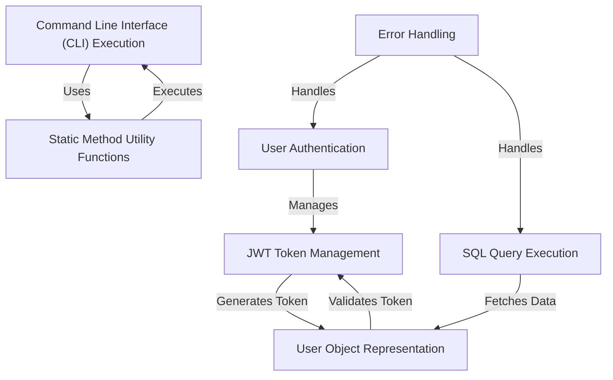

# Tutorial: java-ai

The **java-ai** project is a simple application that handles user authentication using JWT tokens and interacts with a database to fetch user information. It also provides a command-line interface (CLI) for external commands and includes error handling to manage exceptions gracefully. The *User* object represents users and static methods provide utility functions to support various operations.

**Source Repository:** [None](None)

## Chapters

1. [User Authentication
](01_user_authentication_.md)
2. [JWT Token Management
](02_jwt_token_management_.md)
3. [User Object Representation
](03_user_object_representation_.md)
4. [SQL Query Execution
](04_sql_query_execution_.md)
5. [Command Line Interface (CLI) Execution
](05_command_line_interface__cli__execution_.md)
6. [Static Method Utility Functions
](06_static_method_utility_functions_.md)
7. [Error Handling
](07_error_handling_.md)

---

Generated by [ScanSuite](https://scansuite.gitbook.io/scansuite)