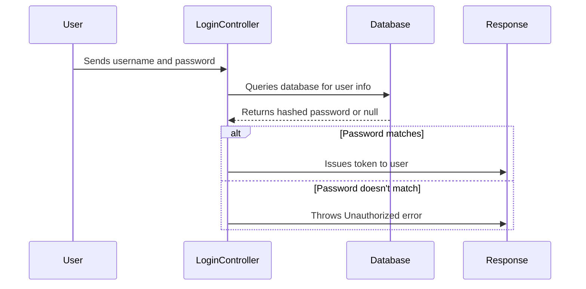

# Chapter 1: User Authentication

Welcome to your first chapter of learning about **User Authentication** in the `vulnado-ai` project! This abstraction is crucial as it controls who can access different parts of our application, much like a bouncer at an event ensures only authorized guests enter. In this chapter, you will learn how to implement and understand user authentication so that you can protect sensitive areas of your app.

## Why Do We Need User Authentication?

Imagine running a club or restaurant where you want to allow only certain people in—say, paying members, VIPs, or those with special access passes. Similarly, when we build web applications, we need to make sure that only authorized users can view specific information or perform actions. This is exactly what user authentication helps us do.

### Example Use Case

Let's say you have a website for an event management company. You want to ensure that only the admin user can modify event details and that regular users (like guests) can only view them. With user authentication, when someone tries to access or change something in your website, the system checks if they are allowed to do so.

## Key Concepts

Before we dive into the code, let's break down some key concepts around user authentication:

1. **User Credentials:** Think of these as a username and password that prove who a person is.
2. **Login Process:** When a user provides their credentials, the application checks if they match what it has stored.
3. **Authorization Token:** Once authenticated, the system issues a special code (token) to the user, which tells other parts of the application that this user is authorized.

### Simplified Flow

Let's walk through these steps using a simple sequence diagram:



## How It Works in Our Application

In `vulnado-ai`, the `LoginController` handles all requests related to logging in. Let's explore its logic piece by piece.

### LoginRequest and LoginResponse Classes

```java
class LoginRequest implements Serializable {
  public String username;
  public String password;
}

class LoginResponse implements Serializable {
  public String token;
  public LoginResponse(String msg) { this.token = msg; }
}
```

- **LoginRequest**: Contains the user's provided `username` and `password`.
- **LoginResponse**: Contains a `token` that the user will use for future requests to indicate they are authenticated.

### The `login()` Method

Let's break down the main method responsible for authenticating a user:

```java
@RequestMapping(value = "/login", method = RequestMethod.POST, produces = "application/json", consumes = "application/json")
LoginResponse login(@RequestBody LoginRequest input) {
  User user = User.fetch(input.username);
  if (Postgres.md5(input.password).equals(user.hashedPassword)) {
    return new LoginResponse(user.token(secret));
  } else {
    throw new Unauthorized("Access Denied");
  }
}
```

- **`@RequestMapping`**: Maps the `/login` endpoint to this method and specifies that it handles POST requests with JSON input.
- **`User.fetch(input.username)`**: Searches for the user in the database using their username. If found, it returns a `User` object containing their information.
- **Password Matching**: Compares the hashed version of the provided password with the stored hashed password. If they match, the user is considered authenticated.
- **Token Issuance**: Generates a token for successful authentication to use in future requests.
- **Unauthorized Exception**: Throws an exception if the credentials do not match.

### Unauthorized Class

```java
@ResponseStatus(HttpStatus.UNAUTHORIZED)
class Unauthorized extends RuntimeException {
  public Unauthorized(String exception) {
    super(exception);
  }
}
```

- **`@ResponseStatus`**: Specifies that this type of exception should result in a HTTP 401 (Unauthorized) response.
- **RuntimeException**: Base class for unchecked exceptions.

### User Class Overview

The `User` class handles user-related operations. Here are some snippets:

```java
public static User fetch(String un) {
    Statement stmt = null;
    User user = null;
    try {
      Connection cxn = Postgres.connection();
      stmt = cxn.createStatement();
      String query = "select * from users where username = '" + un + "' limit 1";
      ResultSet rs = stmt.executeQuery(query);
      if (rs.next()) {
        String user_id = rs.getString("user_id");
        String username = rs.getString("username");
        String password = rs.getString("password");
        user = new User(user_id, username, password);
      }
      cxn.close();
    } catch (Exception e) {
      e.printStackTrace();
      System.err.println(e.getClass().getName()+": "+e.getMessage());
    } finally {
      return user;
    }
  }
```

- **`fetch()` Method**: Queries the database for a user by their username and returns a `User` object if found.
- **Database Connection**: Establishes a connection to the database, executes a query, and processes the result set.

## Internal Implementation Insight

Here's what happens step-by-step when you call the `/login` endpoint:

1. The user submits their username and password through the login form (frontend).
2. The `LoginController` receives the request.
3. It searches for the user in the database using the provided username.
4. If found, it compares the hashed passwords.
5. If they match, the system generates a token for the user.
6. The token is sent back to the frontend, and from then on, the user must provide this token in subsequent requests to prove their identity.

## Conclusion

In this chapter, you learned about the importance of user authentication, how it works in `vulnado-ai`, and explored some key classes and methods involved. You now understand the flow of data between different parts of your application when a user logs in. With this foundational knowledge, we're ready to move on to setting up our database where users' information is stored.

[Next Chapter: Database Setup](02_database_setup_.md)

---

Generated by [ScanSuite](https://scansuite.gitbook.io/scansuite)