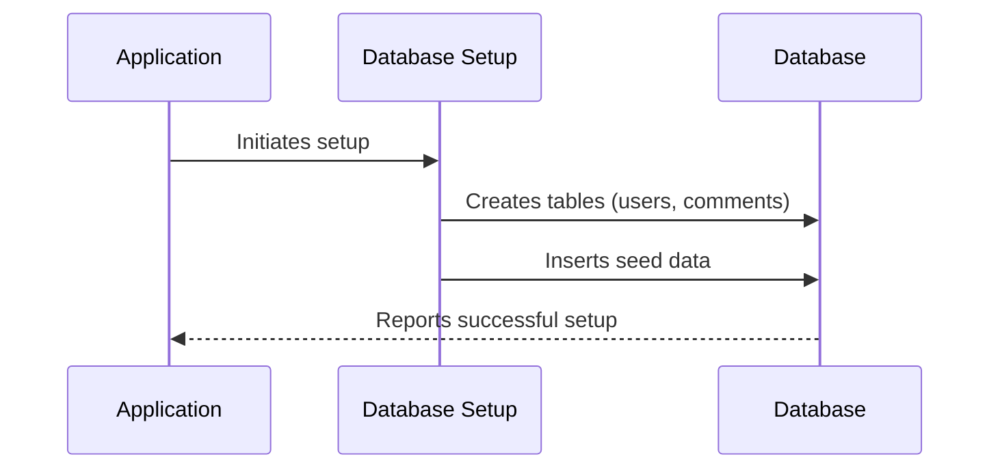

# Chapter 2: Database Setup

Welcome to **Chapter 2: Database Setup** in our `vulnado-ai` tutorial! In [Chapter 1: User Authentication](01_user_authentication_.md), we learned how to ensure that only authorized users can access certain parts of our application. Now, let's dive into setting up the database where user information and other data will be stored.

## Why Do We Need Database Setup?

Imagine you have a library and you need to keep track of all the books it contains. You'd want a system to add new books, remove old ones, find specific titles, and more. A database is like that system but for digital applications. In our `vulnado-ai` project, we need a database to store user information, comments, and other important data.

### Central Use Case

Let's think of an example: You're building a social media platform where users can comment on posts. To manage these comments and user details, you need a structured way to store this information. This is exactly what our database setup will provide.

## Key Concepts

1. **Database Schema**: Think of this as the blueprint for your house. Just like how floors, rooms, and windows are designed in a house plan, tables (floors) are designed in a database schema to hold data.
2. **Tables**: These are structures that contain related data. For our project, we might need tables like `users` to store user information and `comments` to store what users say.
3. **Seed Data**: This is like planting some initial flowers and trees in your garden when you set it up. In a database, seed data populates the tables with initial values that the application needs to function.

### Simplified Flow

Let's walk through these steps using a simple sequence diagram:



- **Application**: The main program that uses the database.
- **Database Setup**: Handles creating tables and filling them with initial data.
- **Database**: Where all the data is stored.

## Setting Up Our Database

Our goal is to create two tables in our database: `users` and `comments`, and fill them with some initial data. Let's break this down step-by-step.

### Step 1: Create Tables

We need to define what information each table will hold:

- **Users Table**: Will store user IDs, usernames, hashed passwords, creation timestamps, and last login times.
- **Comments Table**: Will store comment IDs, usernames (of the commenter), bodies of comments, and creation timestamps.

Here's how we create these tables in code:

```java
// Create Tables
stmt.executeUpdate("CREATE TABLE IF NOT EXISTS users(user_id VARCHAR (36) PRIMARY KEY, username VARCHAR (50) UNIQUE NOT NULL, password VARCHAR (50) NOT NULL, created_on TIMESTAMP NOT NULL, last_login TIMESTAMP)");
stmt.executeUpdate("CREATE TABLE IF NOT EXISTS comments(id VARCHAR (36) PRIMARY KEY, username VARCHAR (36), body VARCHAR (500), created_on TIMESTAMP NOT NULL)");
```

- **`CREATE TABLE IF NOT EXISTS`**: Ensures that the table is created only if it doesn't already exist.
- **Columns and Data Types**: Define the structure of each column (e.g., `VARCHAR` for variable character strings, `TIMESTAMP` for date-time information).

### Step 2: Insert Seed Data

Once we have our tables, we need to put some initial data into them. This is like filling out forms with pre-filled content.

Here's how we insert initial users and comments:

```java
// Insert Users
insertUser("admin", "!!SuperSecretAdmin!!");
insertUser("alice", "AlicePassword!");
insertUser("bob", "BobPassword!");
insertUser("eve", "$EVELknev^l");
insertUser("rick", "!GetSchwifty!");

// Insert Comments
insertComment("rick", "cool dog m8");
insertComment("alice", "OMG so cute!");
```

- **`insertUser()` and `insertComment()`**: These methods insert the specified data into their respective tables.

### Internal Implementation

Let's dive deeper to see how these inserts work. Here’s a simplified version of the methods:

```java
private static void insertUser(String username, String password) {
    try {
        PreparedStatement pStatement = connection().prepareStatement("INSERT INTO users (user_id, username, password, created_on) VALUES (?, ?, ?, current_timestamp)");
        pStatement.setString(1, UUID.randomUUID().toString());
        pStatement.setString(2, username);
        pStatement.setString(3, md5(password));
        pStatement.executeUpdate();
    } catch(Exception e) {
        e.printStackTrace();
    }
}
```

- **`PreparedStatement`**: Used to execute parameterized SQL queries safely.
- **`UUID.randomUUID()`**: Generates a unique user ID for each new user.
- **`md5(password)`**: Hashes the password before storing it in the database.

### Step-by-Step Walkthrough

Here’s what happens when we set up our database:

1. The application initiates the setup process.
2. Tables are created in the database with the specified columns and data types.
3. Initial users and comments are inserted into their respective tables.
4. The database reports that the setup is complete.

## Conclusion

In this chapter, we learned how to set up a database for our `vulnado-ai` application by creating tables and inserting seed data. This foundational step will help us manage user information and comments effectively. 

Now that we have our database ready, let's move on to the next step: interacting with this database through [Chapter 3: User Data Management](03_user_data_management.md). Stay tuned!

---

Generated by [ScanSuite](https://scansuite.gitbook.io/scansuite)