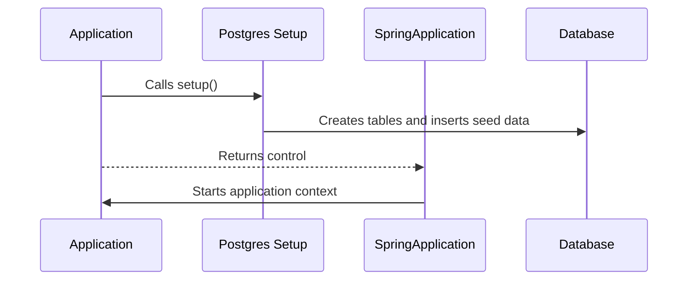

# Chapter 3: Application Entry Point

Welcome to **Chapter 3: Application Entry Point**! In [Chapter 2: Database Setup](02_database_setup_.md), we learned how to create and populate our database tables with initial data. Now, it's time to explore the main entry point of our `vulnado-ai` application. This is where everything begins—like pressing the ignition button to start your car!

## Why Do We Need an Application Entry Point?

Imagine starting a video game: there needs to be a specific action that tells the computer, "Okay, let's play!" In a software application, this is called the **entry point**. It's responsible for initializing and running the entire application, setting up configurations like our database connections.

### Central Use Case

Let's use an example: Suppose we have a social media platform where users can log in and comment on posts. To make sure everything works correctly when someone first opens the app, we need to perform some initial tasks. This is exactly what our entry point will handle.

## Key Concepts

1. **Main Method**: The starting point for any Java application. It's like the main door of a building—we enter through it to use the application.
2. **Spring Boot Application**: A framework that simplifies the creation and setup of new Spring applications. Think of it as a tool chest that comes with all the necessary tools pre-installed.
3. **Configuration Setup**: Tasks that need to be done before the application starts, such as setting up the database or loading configuration files.

## How It Works in Our Application

In `vulnado-ai`, the `VulnadoApplication` class is our main entry point. Let's break down its logic step-by-step.

### The `main()` Method

This is the starting point for our application. Let’s take a look at it:

```java
public static void main(String[] args) {
    Postgres.setup();
    SpringApplication.run(VulnadoApplication.class, args);
}
```

- **`Postgres.setup();`**: Calls a method to set up our database.
- **`SpringApplication.run()`**: Starts the Spring Boot application.

### Internal Implementation

Let's dive deeper into what happens step-by-step when we run our application. Here’s a simplified sequence diagram:



- **`Application`**: The main class with the `main()` method.
- **`Postgres Setup`**: Handles database initialization.
- **`SpringApplication`**: Manages the application lifecycle.
- **`Database`**: Where all our data is stored.

### Detailed Code Walkthrough

Let's take a closer look at the key parts of our `main()` method:

```java
public static void main(String[] args) {
    Postgres.setup();  // Initialize database
    SpringApplication.run(VulnadoApplication.class, args);  // Start application
}
```

- **`Postgres.setup()`**: This method sets up the database by creating necessary tables and inserting initial data.
- **`SpringApplication.run(VulnadoApplication.class, args)`**: This starts our Spring Boot application, which includes setting up web components and controllers.

## Conclusion

In this chapter, we learned about the Application Entry Point in `vulnado-ai`. We explored how the `main()` method initializes our database and starts the Spring Boot application. This foundational step ensures that everything is set up correctly for users to interact with our platform.

Now that we understand how to start our application, let's move on to managing user data through [Chapter 4: User Data Management](04_user_data_management.md). Stay tuned!

---

Generated by [ScanSuite](https://scansuite.gitbook.io/scansuite)