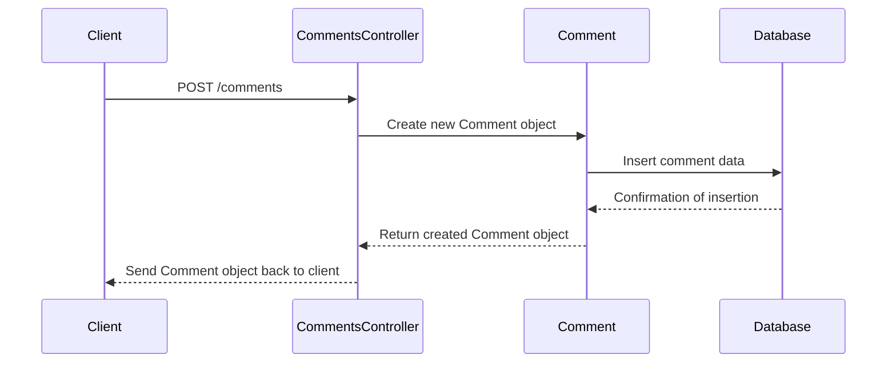
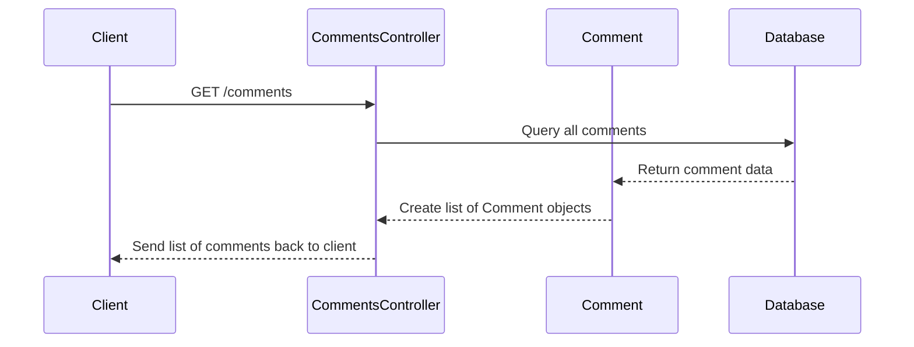

# Chapter 4: Comment Management

## Transition from Previous Chapter

In [Chapter 3](03_user_data_management.md), we learned how to manage user data in our application. Now that we have users and their comments, we need a way to handle these comments effectively—creating, retrieving, updating, and deleting them as needed.

## High-Level Motivation

Imagine you're building a blogging platform where users can leave comments on articles. To make this possible, we need to manage comments efficiently. In this chapter, we will explore how to create, fetch, and delete comments using our application infrastructure.

### Central Use Case

Let's consider the central use case of allowing a user to add a comment to an article. We want to ensure that:

1. A user can post a comment without issues.
2. All comments are stored properly in the database.
3. Comments can be retrieved easily when needed.
4. Users or administrators can delete comments if required.

This abstraction solves the problem of effective comment management for our application.

## Key Concepts

### Creating Comments
To create a new comment, we need to capture the user's input (username and body) and store it in the database with a unique identifier.

### Fetching Comments
We need a method to retrieve all comments from the database so they can be displayed on the platform.

### Deleting Comments
Sometimes, comments need to be removed. We should have a way to delete comments based on their unique identifiers.

## Using This Abstraction

Let's go through how to use these key concepts in our application with some simple examples.

### Creating a Comment

**Example Input:**
```json
{
  "username": "john_doe",
  "body": "Great article!"
}
```

**Code Walkthrough:**

1. The client sends a POST request to `/comments` with the input data.
2. The `CommentsController` method `createComment()` is triggered.
3. A new comment is created and stored in the database.

```java
public static Comment create(String username, String body){
  long time = new Date().getTime();
  Timestamp timestamp = new Timestamp(time);
  Comment comment = new Comment(UUID.randomUUID().toString(), username, body, timestamp);
  // Code to save comment in the database
}
```

**Explanation:**
- A unique ID is generated using `UUID.randomUUID()`.
- Current timestamp is recorded.
- A new `Comment` object is created with these details and saved.

### Fetching All Comments

**Code Walkthrough:**

1. The client sends a GET request to `/comments`.
2. The `CommentsController` method `comments()` fetches all comments from the database.

```java
public static List<Comment> fetch_all() {
  // Code to query all comments from the database
}
```

**Explanation:**
- A SQL query is used to retrieve all comment details.
- These details are mapped to `Comment` objects and returned as a list.

### Deleting a Comment

**Example Input:**

Comment ID: `1234567890`

**Code Walkthrough:**

1. The client sends a DELETE request to `/comments/1234567890`.
2. The `CommentsController` method `deleteComment()` is triggered.
3. The comment with the specified ID is deleted from the database.

```java
public static Boolean delete(String id) {
  // Code to delete the comment with the given ID
}
```

**Explanation:**
- A SQL query is executed to delete the comment based on its unique identifier.

## Internal Implementation

### Step-by-Step Walkthrough

Let's walk through a simple example of creating and fetching comments using sequence diagrams.

#### Creating a Comment



**Explanation:**
- The client sends a POST request with comment data.
- `CommentsController` creates a new `Comment` object and inserts it into the database.
- Confirmation is sent back through the controllers, and the client receives the created comment.

#### Fetching Comments



**Explanation:**
- The client sends a GET request.
- `CommentsController` queries the database for all comments.
- Data is mapped to `Comment` objects and returned to the client.

### Detailed Code Walkthrough

Let's break down some key methods used in our application:

#### Creating a Comment

```java
public static Comment create(String username, String body){
  long time = new Date().getTime();
  Timestamp timestamp = new Timestamp(time);
  Comment comment = new Comment(UUID.randomUUID().toString(), username, body, timestamp);
  // Code to save comment in the database
}
```

**Explanation:**
- A unique ID is generated.
- Current timestamp is recorded.
- The `Comment` object is created and stored.

#### Fetching All Comments

```java
public static List<Comment> fetch_all() {
  Statement stmt = null;
  List<Comment> comments = new ArrayList();
  try {
    Connection cxn = Postgres.connection();
    stmt = cxn.createStatement();
    String query = "select * from comments;";
    ResultSet rs = stmt.executeQuery(query);
    // Loop through result set and create Comment objects
  } finally {
    return comments;
  }
}
```

**Explanation:**
- A SQL query is used to fetch all comments.
- Each row in the result set is converted to a `Comment` object.

#### Deleting a Comment

```java
public static Boolean delete(String id) {
  String sql = "DELETE FROM comments WHERE id = ?";
  Connection con = Postgres.connection();
  PreparedStatement pStatement = con.prepareStatement(sql);
  // Set the placeholder in SQL with comment ID and execute update
}
```

**Explanation:**
- A prepared statement is used to safely delete a comment by its ID.

## Conclusion

In this chapter, we learned about managing comments in our application through creating, fetching, and deleting operations. We explored how these functionalities can be implemented using Spring Boot controllers and database interactions. 

Next, let's dive deeper into handling authentication for our users in [Chapter 5: Authentication](05_authentication.md).

---

Generated by [ScanSuite](https://scansuite.gitbook.io/scansuite)