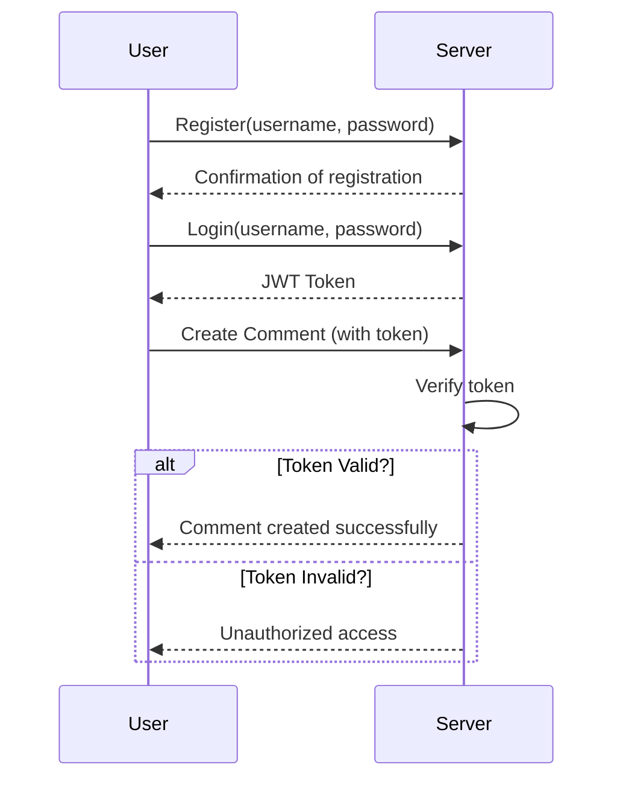

# Chapter 5: Authentication

## Transition from Previous Chapter

In [Chapter 4: Managing Comments](04_managing_comments.md), we learned how to create, fetch, and delete comments in our application. However, anyone could make these changes without any restrictions. In this chapter, we will introduce the concept of authentication to ensure that users can only perform actions if they are logged in and authorized.

## High-Level Motivation

Imagine you have a online diary where you share thoughts with friends and family. You would want to make sure that only you (and maybe specific others) can add or modify entries, not just anyone on the internet. This is exactly what authentication helps us achieve. By implementing authentication, we can verify the identity of users before allowing them to perform certain actions in our application.

### Central Use Case

**Problem:** We want to ensure that only registered users can create and delete comments.
**Solution:** Implement an authentication mechanism where each user must log in with a username and password to get a special token. This token will be used for all subsequent actions, proving the user's identity.

## Key Concepts

### 1. User Registration
Before anyone can authenticate, they need to register by providing a unique username and a password. The password should never be stored directly; instead, we will store its hash (a one-way transformation of the password).

### 2. Token Generation
Once a user logs in with their correct credentials, we generate a JSON Web Token (JWT) for them. This token contains information about the user that can be verified later.

### 3. Token Verification
For any action requiring authentication, the application will check the JWT to ensure it is valid and issued by the server. If the token is valid, the action proceeds; otherwise, it is denied.

## How to Use Authentication

Let's use a simple example to understand how this works in practice.

### Registration Example

**Example Input:**
- **Username:** alice
- **Password:** AlicePassword!

When a user registers, their credentials are stored securely in the database with the password being hashed:
```java
public static void insertUser(String username, String password) {
    String sql = "INSERT INTO users (user_id, username, password, created_on) " +
                 "VALUES (?, ?, ?, current_timestamp)";
    PreparedStatement pStatement = null;
    try {
        pStatement = connection().prepareStatement(sql);
        pStatement.setString(1, UUID.randomUUID().toString());
        pStatement.setString(2, username);
        pStatement.setString(3, md5(password));
        pStatement.executeUpdate();
    } catch(Exception e) {
        e.printStackTrace();
    }
}
```
*This code snippet shows how a new user is inserted into the `users` table. The password is hashed using an MD5 hash function before storage.*

### Login Example

**Example Input:**
- **Username:** alice
- **Password:** AlicePassword!

When a user logs in, we fetch their record from the database and compare the provided password with the stored hash:
```java
public static User fetch(String un) {
    Statement stmt = null;
    User user = null;
    try {
        Connection cxn = connection();
        stmt = cxn.createStatement();
        String query = "select * from users where username = '" + un + "' limit 1";
        ResultSet rs = stmt.executeQuery(query);
        if (rs.next()) {
            String user_id = rs.getString("user_id");
            String username = rs.getString("username");
            String password = rs.getString("password");
            user = new User(user_id, username, password);
        }
        cxn.close();
    } catch (Exception e) {
        e.printStackTrace();
        System.err.println(e.getClass().getName()+": "+e.getMessage());
    } finally {
        return user;
    }
}
```
*This code fetches a user's details based on the username. It compares the provided password (hashed) with the stored hash to verify credentials.*

### Token Generation Example

Once verified, we generate a JWT:
```java
public String token(String secret) {
    SecretKey key = Keys.hmacShaKeyFor(secret.getBytes());
    String jws = Jwts.builder()
                    .setSubject(this.username)
                    .signWith(key)
                    .compact();
    return jws;
}
```
*This method generates a JWT that identifies the user. The token is signed with a secret key to ensure its authenticity.*

### Token Verification Example

For any protected action (e.g., creating a comment), we verify the JWT:
```java
public static void assertAuth(String secret, String token) {
    try {
        SecretKey key = Keys.hmacShaKeyFor(secret.getBytes());
        Jwts.parser()
            .setSigningKey(key)
            .parseClaimsJws(token);
    } catch(Exception e) {
        e.printStackTrace();
        throw new Unauthorized(e.getMessage());
    }
}
```
*This method checks if the provided token is valid by verifying it against the secret key.*

## Internal Implementation

### Step-by-Step Walkthrough

1. **User Registers:**
   - Input username and password.
   - Password is hashed using MD5.
   - User details (including hashed password) are stored in the `users` table.

2. **User Logs In:**
   - Server retrieves user record based on username.
   - Provided password's hash is compared with stored hash.
   - If they match, a JWT is generated and returned to the user.

3. **Protected Action (e.g., Creating Comment):**
   - User includes the JWT in the request header.
   - Server verifies the token.
   - If valid, the action proceeds; otherwise, it is denied.

### Simplified Sequence Diagram



### Detailed Code Walkthrough

#### User Registration
```java
// Simplified registration code
User newUser = new User(UUID.randomUUID().toString(), "alice", Postgres.md5("AlicePassword!"));
Postgres.insertUser(newUser.username, newUser.hashedPassword);
```
*This snippet demonstrates how a user's details are stored with the password being hashed.*

#### Login and Token Generation
```java
// Simplified login code
User loggedInUser = User.fetch("alice");
String token = loggedInUser.token("your-256-bit-secret");
System.out.println("Generated JWT: " + token);
```
*This snippet shows how a user logs in to generate a JWT.*

#### Token Verification for Protected Actions
```java
// Simplified verification code
try {
    User.assertAuth("your-256-bit-secret", token);
    System.out.println("Access granted");
} catch (Unauthorized e) {
    System.out.println("Access denied: " + e.getMessage());
}
```
*This snippet checks if the provided JWT is valid for accessing protected resources.*

## Conclusion

In this chapter, we implemented a simple authentication system using JWTs to manage user identities securely. We covered registration, login, and token verification processes. By understanding how authentication works, you can now protect your application's actions from unauthorized access.

Next, let's explore how to handle authorization in [Chapter 6: Authorization](06_authorization.md).

---

Generated by [ScanSuite](https://scansuite.gitbook.io/scansuite)