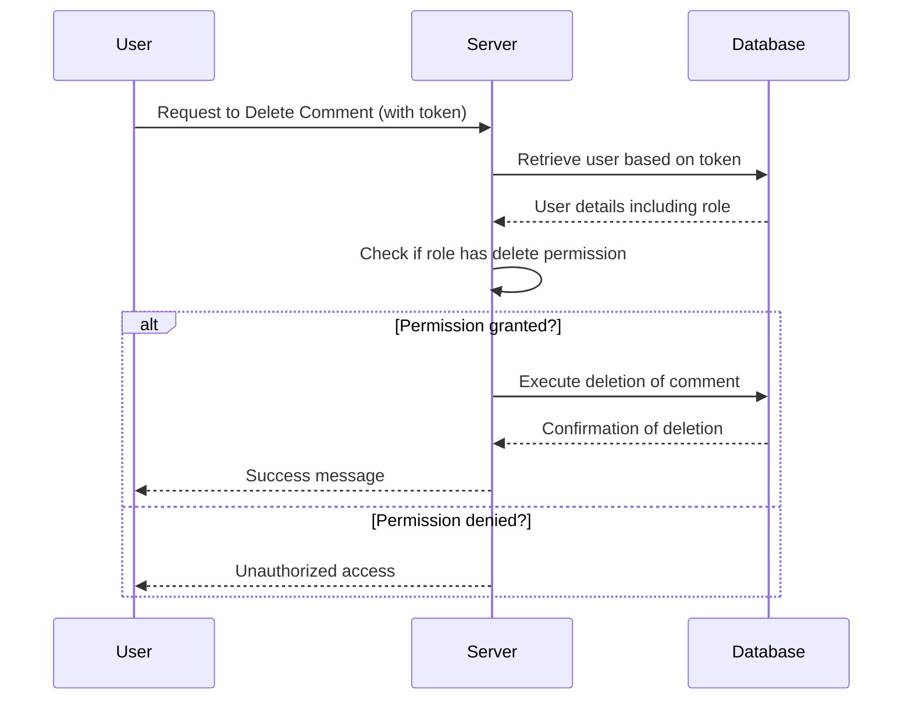

# Chapter 6: Authorization

## Transition from Chapter 5

In [Chapter 5](05_authorization.md), we learned how to protect our application's actions using authentication with JSON Web Tokens (JWTs). We ensured that only users who log in correctly can perform certain tasks, such as creating comments. Now, let's take it a step further and ensure that users not only have access but also the right permissions to perform specific actions.

## High-Level Motivation

Imagine you have a social media platform where users can post content. You want to ensure that only administrators can delete posts, while regular users can only edit their own posts. This is where authorization comes in. It allows us to define specific rules about what actions different types of users are permitted to perform.

**Central Use Case:**  
A user logs in and tries to perform an action like deleting a post. Our application should not allow this unless the user has the necessary permissions (e.g., being an administrator).

## Key Concepts

1. **Role-Based Access Control (RBAC):**
   - Divide users into roles (e.g., admin, user).
   - Assign permissions to these roles.
   - Check if a user’s role allows them to perform a specific action.

2. **Permissions:**
   - Define what actions can be performed.
   - Assign these permissions to roles.

3. **Access Control Lists (ACLs):**
   - Lists that specify which entities have access to certain resources or actions.

## How to Use Authorization

Let's see how we can implement authorization in our application step-by-step.

### Example Scenario
- A user named `admin` wants to delete a post.
- A user named `alice` tries to delete the same post but is not authorized.

**Step 1: Define Roles and Permissions**

```java
// Role definitions
public class Role {
    public static final String ADMIN = "admin";
    public static final String USER = "user";

    // Permissions for each role
    public static boolean canDelete(String role) {
        return role.equals(ADMIN);
    }
}
```
*This snippet defines roles and checks if a user has the permission to delete a post.*

**Step 2: Update User Model with Role**

```java
// Simplified User class
public class User {
    String userId;
    String username;
    String hashedPassword;
    String role;

    public User(String userId, String username, String hashedPassword, String role) {
        this.userId = userId;
        this.username = username;
        this.hashedPassword = hashedPassword;
        this.role = role;
    }

    // Method to verify if the user can perform an action
    public boolean isAuthorizedToDelete() {
        return Role.canDelete(this.role);
    }
}
```
*This snippet extends the User class to include a role and checks authorization for deleting.*

**Step 3: Implement Authorization in Delete Comment Action**

```java
// Simplified deletion code in CommentsController
public void deleteComment(String token, String commentId) {
    User user = authenticateUser(token);
    if (user.isAuthorizedToDelete()) {
        Postgres.deleteComment(commentId);
        System.out.println("Post deleted successfully.");
    } else {
        throw new UnauthorizedException("You are not authorized to delete this post.");
    }
}
```
*This snippet checks if the authenticated user has permission to delete a comment.*

### Example Inputs and Outputs

- **Admin User (admin):**
  - Input: `deleteComment(adminToken, "123abc")`
  - Output: `Post deleted successfully.`

- **Regular User (alice):**
  - Input: `deleteComment(aliceToken, "123abc")`
  - Output: Exception: `You are not authorized to delete this post.`

## Internal Implementation

### Step-by-Step Walkthrough

1. **User Authentication:**
   - Server verifies the JWT token.
   - Retrieves user details.

2. **Role Check:**
   - Determines the user's role.
   - Checks if the role has permission for the requested action.

3. **Action Execution:**
   - If authorized, performs the action (e.g., delete post).
   - Otherwise, denies access.

### Simplified Sequence Diagram



### Detailed Code Walkthrough

#### Role Class
```java
// Role class with permission checks
public class Role {
    public static final String ADMIN = "admin";
    public static final String USER = "user";

    // Check if a role can delete posts
    public static boolean canDelete(String role) {
        return role.equals(ADMIN);
    }
}
```
*This snippet defines roles and includes an authorization method for deleting posts.*

#### Enhanced User Class
```java
// User class with role attribute
public class User {
    String userId;
    String username;
    String hashedPassword;
    String role;

    public User(String userId, String username, String hashedPassword, String role) {
        this.userId = userId;
        this.username = username;
        this.hashedPassword = hashedPassword;
        this.role = role;
    }

    // Check if user can delete posts
    public boolean isAuthorizedToDelete() {
        return Role.canDelete(this.role);
    }
}
```
*This snippet enhances the User class to include roles and checks for permissions.*

#### Controller Method with Authorization
```java
// Controller method in CommentsController
public void deleteComment(String token, String commentId) {
    User user = authenticateUser(token); // Assume authenticateUser retrieves user from DB based on token
    if (user.isAuthorizedToDelete()) {
        Postgres.deleteComment(commentId);
        System.out.println("Post deleted successfully.");
    } else {
        throw new UnauthorizedException("You are not authorized to delete this post.");
    }
}
```
*This snippet shows how to implement authorization in the `deleteComment` method.*

## Conclusion

In this chapter, we learned about implementing authorization in our application. By defining roles and permissions, we ensure that only users with the appropriate access rights can perform specific actions, such as deleting posts. This adds an additional layer of security beyond authentication.

Next, let's explore how to handle more complex scenarios, such as fine-grained permission control and logging user activities, in [Chapter 7: Advanced Authorization](07_advanced_authorization.md).

---

Generated by [ScanSuite](https://scansuite.gitbook.io/scansuite)