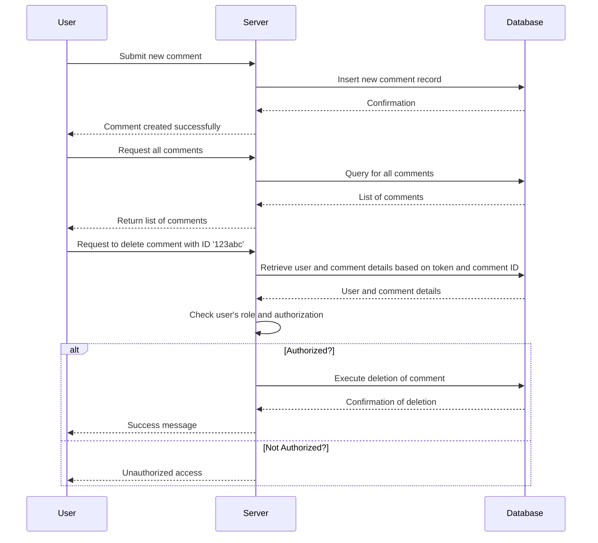

# Chapter 7: Comment Data


## Transition from Previous Chapters

In the previous chapters, we learned how to manage user authentication and authorization. Now, let's dive into handling comment data in our application. This will involve creating, fetching, and deleting comments while ensuring that only authorized users can perform these actions.

## High-Level Motivation

Imagine you are building a blog where users can leave comments on posts. You need to ensure that:

- Users can post comments.
- All comments can be listed for visibility.
- Only the admin or the user who posted a comment can delete it.

This chapter will guide you through implementing these functionalities securely and efficiently.

## Central Use Case

**Central Use Case:** Create, fetch, and delete comments in a blog application while ensuring that only authorized users can perform these actions.

## Key Concepts

1. **Creating Comments:**
   - How to capture and store user comments.
   
2. **Fetching Comments:**
   - How to retrieve all comments associated with a post.
   
3. **Deleting Comments:**
   - Ensuring that only the admin or the comment author can delete a comment.

### Creating Comments

**Concept:** Store comments in a database when users submit them.

**How it Works:** When a user submits a comment, it is stored in a `comments` table along with metadata like username and timestamp.

##### Simple Code Example:
```java
public static Comment create(String username, String body) {
    long time = new Date().getTime();
    Timestamp timestamp = new Timestamp(time);
    return new Comment(UUID.randomUUID().toString(), username, body, timestamp).commit() ? 
           new Comment(...) : null;
}
```
*This method creates a comment object and attempts to save it in the database.*

### Fetching Comments

**Concept:** Retrieve all comments from the database.

**How it Works:** Fetch all rows from the `comments` table and convert them into a list of `Comment` objects.

##### Simple Code Example:
```java
public static List<Comment> fetch_all() {
    Statement stmt = null;
    List<Comment> comments = new ArrayList();
    try {
        Connection cxn = Postgres.connection();
        stmt = cxn.createStatement();
        ResultSet rs = stmt.executeQuery("select * from comments;");
        while (rs.next()) {
            Comment c = new Comment(rs.getString("id"), 
                                    rs.getString("username"), 
                                    rs.getString("body"), 
                                    rs.getTimestamp("created_on"));
            comments.add(c);
        }
    } catch (Exception e) {}
    return comments;
}
```
*This method retrieves all comments from the database.*

### Deleting Comments

**Concept:** Securely delete a comment only if the user is authorized.

**How it Works:** Check the user's role and authorization before deleting the comment. Only allow deletions by admins or the original commenter.

##### Simple Code Example:
```java
public static Boolean delete(String id) {
    try {
        Connection con = Postgres.connection();
        PreparedStatement pStatement = con.prepareStatement("DELETE FROM comments where id = ?");
        pStatement.setString(1, id);
        return 1 == pStatement.executeUpdate();
    } catch (Exception e) {}
    return false;
}
```
*This method deletes a comment if the user is authorized.*

## How to Solve the Use Case

### Creating Comments

**Inputs:**
- `username`: The commenter's username.
- `body`: The content of the comment.

**Outputs:**
- A new comment object saved in the database or an error message if failed.

##### Example User Input:
```java
Comment.create("alice", "Great post!");
```
*This creates a new comment with the username 'alice' and body 'Great post!'*

### Fetching Comments

**Inputs:**
- None, just fetch all comments from the `comments` table.

**Outputs:**
- A list of all `Comment` objects.

##### Example Output:
```java
List<Comment> comments = Comment.fetch_all();
```
*This retrieves and lists all comments.*

### Deleting Comments

**Inputs:**
- `id`: The unique identifier for the comment to be deleted.
- Authorization check (handled internally).

**Outputs:**
- Boolean value indicating if deletion was successful or not.

##### Example User Input:
```java
Boolean success = Comment.delete("123abc");
```
*This attempts to delete a comment with ID '123abc' if the user is authorized.*

## Internal Implementation

### Step-by-Step Walkthrough

1. **Create Comment:**
   - The client submits a new comment.
   - The server creates and commits this comment into the database.

2. **Fetch Comments:**
   - The client requests all comments.
   - The server queries the database for all comments and returns them as a list of `Comment` objects.

3. **Delete Comment:**
   - The client requests to delete a specific comment.
   - The server checks if the user is authorized (admin or original commenter).
   - If authorized, the server deletes the comment from the database.

### Sequence Diagram



### Detailed Code Walkthrough

#### Comment Class - Create Method
```java
public static Comment create(String username, String body) {
    long time = new Date().getTime();
    Timestamp timestamp = new Timestamp(time);
    return new Comment(UUID.randomUUID().toString(), username, body, timestamp).commit() ? 
           new Comment(...) : null;
}
```
*This method creates a new comment with a unique ID and current timestamp.*

#### Comment Class - Fetch All Method
```java
public static List<Comment> fetch_all() {
    Statement stmt = null;
    List<Comment> comments = new ArrayList();
    try {
        Connection cxn = Postgres.connection();
        stmt = cxn.createStatement();
        ResultSet rs = stmt.executeQuery("select * from comments;");
        while (rs.next()) {
            Comment c = new Comment(rs.getString("id"), 
                                    rs.getString("username"), 
                                    rs.getString("body"), 
                                    rs.getTimestamp("created_on"));
            comments.add(c);
        }
    } catch (Exception e) {}
    return comments;
}
```
*This method retrieves all comments from the database.*

#### Comment Class - Delete Method with Authorization
```java
public static Boolean delete(String id, User user) {
    try {
        Connection con = Postgres.connection();
        PreparedStatement pStatement = con.prepareStatement("DELETE FROM comments where id = ?");
        pStatement.setString(1, id);
        if (user.isAuthorizedToDelete(id)) {
            return 1 == pStatement.executeUpdate();
        }
    } catch (Exception e) {}
    return false;
}
```
*This method checks user authorization before deleting the comment.*

## Conclusion

In this chapter, we learned how to manage comments in a blog application. We covered creating, fetching, and securely deleting comments based on user authorization.

Next, let's explore how to enhance our blog with advanced features like handling likes and dislikes on posts in [Chapter 9: Advanced Comment Features](09_advanced_comment_features.md).

---

Generated by [ScanSuite](https://scansuite.gitbook.io/scansuite)