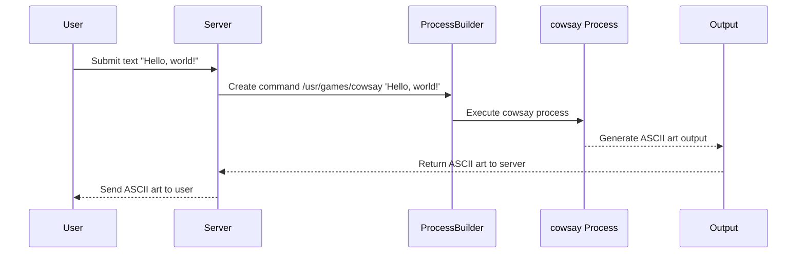

# Chapter 8: External Command Execution

## Transition from Previous Chapter

In [Chapter 7](07_comment_management.md), we learned how to manage comments in our blog application. We covered creating, fetching, and securely deleting comments based on user authorization. Now, let's explore a different scenario where we need to execute external commands from within our application.

## High-Level Motivation

Imagine you have a fun website where users can submit text and see it displayed through the cow ASCII art generator (`cowsay`). The `cowsay` utility takes input text and displays it wrapped in an amusing ASCII cow. This feature not only entertains users but also demonstrates how to execute external commands from within our application.

## Central Use Case

Our use case is straightforward: allow users to submit a piece of text, and the server will return the text displayed as an ASCII cow using `cowsay`. The input text can be anything—jokes, messages, or even code snippets!

## Key Concepts

### External Commands
- **Definition**: External commands are executables or scripts that run outside our application but can be invoked from it.
- **Example**: The `cowsay` command is an external utility that we want to use to generate ASCII art.

### ProcessBuilder
- **Definition**: `ProcessBuilder` is a Java class used to create operating system processes. It allows us to start and manage the execution of commands.
- **Why it's Useful**: It provides more flexibility and control over process creation compared to other methods like `Runtime.getRuntime().exec()`.

### Command Injection
- **Definition**: Command injection occurs when an attacker can provide input that alters the intended command executed by the system.
- **Risk**: An attacker could inject malicious commands, leading to potential security vulnerabilities.
- **Mitigation**: Always sanitize and validate user inputs before using them in external commands.

## How to Use External Commands

### Example User Input
Let's assume a user submits the text "Hello, world!" through our application. We want to generate ASCI art of this message using `cowsay`.

#### Code Snippet for Execution
```java
public static String run(String input) {
    ProcessBuilder processBuilder = new ProcessBuilder();
    String cmd = "/usr/games/cowsay '" + input + "'";
    processBuilder.command("bash", "-c", cmd);

    StringBuilder output = new StringBuilder();

    try {
        Process process = processBuilder.start();
        BufferedReader reader = new BufferedReader(new InputStreamReader(process.getInputStream()));

        String line;
        while ((line = reader.readLine()) != null) {
            output.append(line + "\n");
        }
    } catch (Exception e) {
        e.printStackTrace();
    }
    return output.toString();
}
```

**Explanation**: 
- The `run` method takes user input and constructs a command to call `cowsay`.
- We use `ProcessBuilder` to execute the command.
- The command's output is read using a `BufferedReader`, and each line is appended to a `StringBuilder`.

#### Example Output
If the user inputs "Hello, world!", the server will return:
```
 _______________
< Hello, world! >
 ---------------
        \   ^__^
         \  (oo)\_______
            (__)\       )\/\
                ||----w |
                ||     ||
```

This is the ASCII art generated by `cowsay`.

## Internal Implementation

### Step-by-Step Walkthrough

1. **User Submits Input**: The user submits their text through a web request.
2. **ProcessBuilder Executes Command**:
   - We construct a command string to invoke `cowsay` with user input.
   - `ProcessBuilder` starts the process and executes the command.
3. **Read Output**:
   - The output generated by `cowsay` is read line-by-line using a `BufferedReader`.
4. **Return Result**: The complete ASCII art string is returned to the user.

### Sequence Diagram



### Detailed Code Walkthrough

#### CowController Class - cowsay Method
```java
@RequestMapping(value = "/cowsay")
String cowsay(@RequestParam(defaultValue = "I love Linux!") String input) {
    return Cowsay.run(input);
}
```
**Explanation**: 
- The `cowsay` method in `CowController` receives user input and calls the `run` method of the `Cowsay` class.
- It returns the generated ASCII art to the user.

#### Cowsay Class - run Method
```java
public static String run(String input) {
    ProcessBuilder processBuilder = new ProcessBuilder();
    String cmd = "/usr/games/cowsay '" + input + "'";
    processBuilder.command("bash", "-c", cmd);

    StringBuilder output = new StringBuilder();

    try {
        Process process = processBuilder.start();
        BufferedReader reader = new BufferedReader(new InputStreamReader(process.getInputStream()));

        String line;
        while ((line = reader.readLine()) != null) {
            output.append(line + "\n");
        }
    } catch (Exception e) {
        e.printStackTrace();
    }
    return output.toString();
}
```
**Explanation**: 
- The `run` method constructs the command string.
- It uses `ProcessBuilder` to execute the command.
- Output from `cowsay` is read and returned.

## Conclusion

In this chapter, we learned how to execute external commands in our application using Java's `ProcessBuilder`. We explored a use case where users can submit text to be displayed as ASCII art using `cowsay`. We also discussed the importance of sanitizing user inputs to prevent command injection attacks.

Next, let's enhance our blog with another feature: handling likes and dislikes on posts. [Chapter 9: Advanced Comment Features](09_advanced_comment_features.md) will guide us through adding this functionality.

---

Generated by [ScanSuite](https://scansuite.gitbook.io/scansuite)