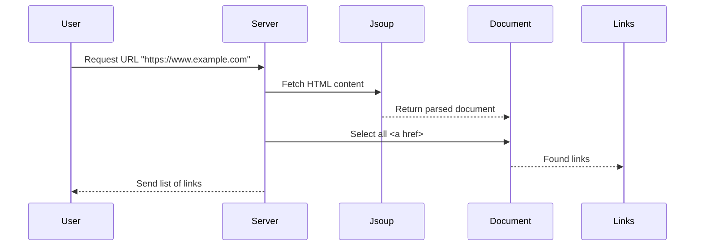

# Chapter 9: Link Extraction Controller

## Transition from Previous Chapter

In [Chapter 8](08_external_command_execution.md), we learned how to execute external commands in our application using Java's `ProcessBuilder`. We used the `cowsay` utility to generate ASCII art from user input. Now, let's move on to a different use case where we need to extract links from HTML content of web pages.

## High-Level Motivation

Imagine you are building a tool that helps users discover new websites by extracting all the hyperlinks from any given URL. For example, if someone provides the URL `https://www.example.com`, your application should return a list of all the links found on that page, such as `https://www.example.com/about` or `https://www.example.com/contact`.

## Central Use Case

Our goal is to create a REST endpoint in our Spring Boot application where users can submit a URL and receive a list of hyperlinks extracted from that page. This feature not only helps users discover new content but also serves as a practical example of web scraping.

## Key Concepts

### Web Scraping
- **Definition**: Web scraping is the process of extracting data from websites automatically.
- **Why it's Useful**: It allows us to gather information from multiple sources programmatically, which can be useful for various applications like search engine indexing or content aggregation.

### HTML Links
- **Definition**: Links in HTML are represented by the `<a>` tags, which contain URLs pointing to other resources.
- **Example**: `<a href="https://www.example.com/about">About Us</a>` is a common link tag.

### Java Libraries for Web Scraping
- **Definition**: Libraries like Jsoup help us parse and extract data from HTML documents.
- **Why it's Useful**: Jsoup provides a very convenient and flexible way to work with HTML content in Java.

## How to Use This Abstraction

### Example User Input
Let's assume a user submits the URL `https://www.example.com`. We want our application to return all hyperlinks found on this page.

#### Code Snippet for Execution
Here's how we can extract links from an HTML document:

```java
// Import Jsoup library
import org.jsoup.Jsoup;
import org.jsoup.nodes.Document;
import org.jsoup.nodes.Element;
import org.jsoup.select.Elements;

public List<String> getLinks(String url) {
    // Fetch the content of the given URL
    Document doc = Jsoup.connect(url).get();
    // Find all elements with the <a> tag
    Elements links = doc.select("a[href]");
    // Extract href attributes and return as a list
    return links.stream()
                .map(link -> link.attr("abs:href"))
                .collect(Collectors.toList());
}
```

**Explanation**: 
- We use Jsoup to connect to the URL and fetch the HTML content.
- We select all elements with the `<a>` tag that have an `href` attribute.
- The `attr("abs:href")` method extracts absolute URLs from these links.
- Finally, we collect and return the list of URLs.

#### Example Output
If the user inputs `https://www.example.com`, the server might return:

```
[
    "https://www.example.com/about",
    "https://www.example.com/contact",
    "https://www.example.com/blog"
]
```

This is a simple JSON array containing all the hyperlinks found on the page.

## Internal Implementation

### Step-by-Step Walkthrough

1. **User Requests Links**: The user sends a GET request to our application with a URL parameter.
2. **Fetch HTML Content**:
   - We use Jsoup's `connect` method to fetch the HTML content of the provided URL.
3. **Extract Links**:
   - We select all `<a>` tags and extract their `href` attributes.
4. **Return Result**: The list of links is returned as a JSON response.

### Sequence Diagram



### Detailed Code Walkthrough

#### LinksController Class - getLinks Method
```java
@RequestMapping(value = "/links", produces = "application/json")
List<String> getLinks(@RequestParam String url) throws IOException {
    return LinkLister.getLinks(url);
}
```
**Explanation**: 
- The `getLinks` method in `LinksController` receives a URL from the user.
- It calls the `getLinks` method of the `LinkLister` class to fetch and extract links.
- The list of links is returned as a JSON response.

#### LinkLister Class - getLinks Method
```java
public static List<String> getLinks(String url) throws IOException {
    Document doc = Jsoup.connect(url).get();
    Elements links = doc.select("a[href]");
    return links.stream()
                .map(link -> link.attr("abs:href"))
                .collect(Collectors.toList());
}
```
**Explanation**: 
- The `getLinks` method usesJsoup to connect to the URL and fetch the HTML content.
- It selects all `<a>` tags with an `href` attribute.
- It extracts absolute URLs from these links using `attr("abs:href")`.
- Finally, it collects the URLs into a list and returns them.

## Conclusion

In this chapter, we learned how to extract hyperlinks from web pages using Java's Jsoup library. We created a REST endpoint in our Spring Boot application that allows users to submit a URL and receive a list of links found on that page. We also covered best practices such as handling exceptions and using absolute URLs.

Next, let's explore advanced features for our comment system in [Chapter 10: Advanced Comment Features](10_advanced_comment_features.md).

---

Generated by [ScanSuite](https://scansuite.gitbook.io/scansuite)