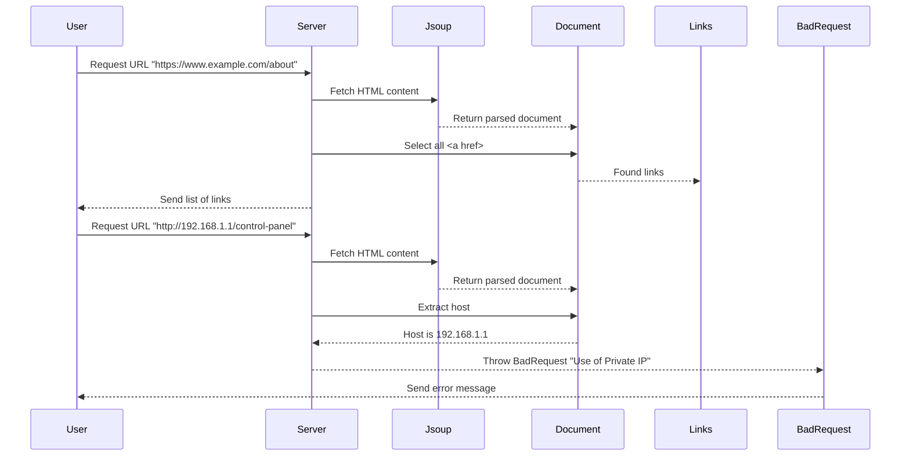

# Chapter 10: Link Parsing

## Transition from Previous Chapter

In [Chapter 9](9_link_parsing.md), we learned how to extract hyperlinks from web pages using the Jsoup library. We created a REST endpoint that allows users to submit a URL and receive a list of links found on that page. Now, let's take it a step further by exploring some advanced features for our link parsing system.

## High-Level Motivation

Imagine you are building a tool that not only extracts hyperlinks from web pages but also ensures that the URLs being processed fall within safe and public domains. This can help prevent potential security issues like internal network scanning or unauthorized access to private servers. For example, if someone tries to submit a URL with a private IP address (like `192.168.1.1`), your application should reject such requests.

## Central Use Case

Our goal is to enhance our link parsing system by adding validation checks. Specifically, we want to ensure that the URLs provided do not start with private IP ranges (such as `172.`, `192.168.`, or `10.`). This will help maintain security and prevent accidental access to internal network resources.

## Key Concepts

### URL Parsing
- **Definition**: URL parsing involves breaking down a URL into its components such as protocol, host, port, path, etc.
- **Why it's Useful**: Knowing how to parse URLs helps us extract specific parts like the host for validation purposes.

### Private IP Ranges
- **Definition**: Private IP ranges are reserved blocks of IP addresses used in private networks, such as `172.`, `192.168.`, and `10.`.
- **Why it's Important**: Avoiding these private IPs ensures that our tool does not inadvertently access internal network resources.

### Exception Handling
- **Definition**: Exception handling is the process of managing error conditions within a program.
- **Why it's Useful**: Proper exception handling helps make our application more robust and user-friendly by providing meaningful error messages when something goes wrong.

## How to Use This Abstraction

To implement these features, we will modify our existing `getLinks` method to include validation checks. Here's how we can do it:

#### Example User Input
Let's assume a user submits the following URLs:
- `https://www.example.com/about` (valid)
- `http://192.168.1.1/control-panel` (invalid)

### Code Snippet for Validation

```java
// Import necessary libraries
import java.io.IOException;
import java.net.*;

public static List<String> getLinksV2(String url) throws BadRequest {
    try {
        URL aUrl = new URL(url);
        String host = aUrl.getHost();
        if (host.startsWith("172.") || host.startsWith("192.168") || host.startsWith("10.")) {
            throw new BadRequest("Use of Private IP");
        } else {
            return getLinks(url);
        }
    } catch (Exception e) {
        throw new BadRequest(e.getMessage());
    }
}
```

**Explanation**: 
- We first parse the URL using Java's `URL` class.
- We extract the host part of the URL.
- We check if the host starts with any known private IP range (`172.`, `192.168.`, or `10.`).
- If it does, we throw a custom `BadRequest` exception to indicate an invalid request.
- If the URL is valid, we proceed to extract links using our existing method.

#### Example Output
If the user inputs:
- `https://www.example.com/about`, the server will return the list of links as before.
- `http://192.168.1.1/control-panel`, the server will return a `400 Bad Request` response with the message "Use of Private IP".

## Internal Implementation

### Step-by-Step Walkthrough

1. **User Submits URL**: The user sends a GET request to our application with a URL parameter.
2. **Validate Host**:
   - We parse the URL and extract its host.
   - We check if the host belongs to any private IP range.
3. **Extract Links**:
   - If the URL is valid, we fetch the HTML content using Jsoup and select all `<a>` tags with `href` attributes.
   - We extract absolute URLs from these links.
4. **Return Result**: The list of links is returned as a JSON response if the URL is valid.

### Sequence Diagram



### Detailed Code Walkthrough

#### LinksController Class - getLinks Method

```java
@RequestMapping(value = "/links", produces = "application/json")
List<String> getLinks(@RequestParam String url) throws IOException {
    return LinkLister.getLinksV2(url);
}
```

**Explanation**: 
- The `getLinks` method in `LinksController` receives a URL from the user.
- It calls the enhanced `getLinksV2` method of the `LinkLister` class to fetch and extract links with validation.
- If the URL is valid, it returns the list of links as a JSON response. Otherwise, it throws an exception.

#### LinkLister Class - getLinksV2 Method

```java
public static List<String> getLinksV2(String url) throws BadRequest {
    try {
        URL aUrl = new URL(url);
        String host = aUrl.getHost();
        if (host.startsWith("172.") || host.startsWith("192.168") || host.startsWith("10.")) {
            throw new BadRequest("Use of Private IP");
        } else {
            return getLinks(url);
        }
    } catch (Exception e) {
        throw new BadRequest(e.getMessage());
    }
}
```

**Explanation**: 
- The `getLinksV2` method first parses the URL using Java's `URL` class.
- It extracts the host part of the URL and checks if it starts with any private IP range.
- If a match is found, it throws a custom `BadRequest` exception to indicate an invalid request.
- If the URL is valid, it proceeds to extract links using the existing `getLinks` method.

## Conclusion

In this chapter, we learned how to enhance our link parsing system by adding validation checks to ensure that URLs submitted do not belong to private IP ranges. We used Java's `URL` class for URL parsing, performed necessary host checks, and handled exceptions gracefully. This makes our tool more secure and robust.

Next, let's explore advanced features for our comment system in [Chapter 11: Advanced Comment Features](11_advanced_comment_features.md).

---

Generated by [ScanSuite](https://scansuite.gitbook.io/scansuite)