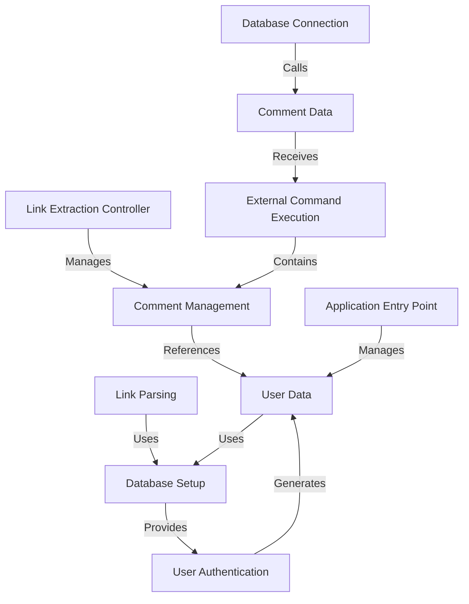

# Tutorial: vulnado-ai

This project is a simple web application built with Java and Spring Boot that manages user authentication, comments, and external commands. It allows users to log in, post comments, delete their posts, and interact with an external `cowsay` command through HTTP requests. **MD5** hashing is used for password security, while *JWT* tokens manage user sessions.

**Source Repository:** [None](None)

## Chapters

1. [User Authentication
](01_user_authentication_.md)
2. [Database Setup
](02_database_setup_.md)
3. [Application Entry Point
](03_application_entry_point_.md)
4. [Comment Management
](04_comment_management_.md)
5. [User Data
](05_user_data_.md)
6. [Database Connection
](06_database_connection_.md)
7. [Comment Data
](07_comment_data_.md)
8. [External Command Execution
](08_external_command_execution_.md)
9. [Link Extraction Controller
](09_link_extraction_controller_.md)
10. [Link Parsing
](10_link_parsing_.md)

---

Generated by [ScanSuite](https://scansuite.gitbook.io/scansuite)